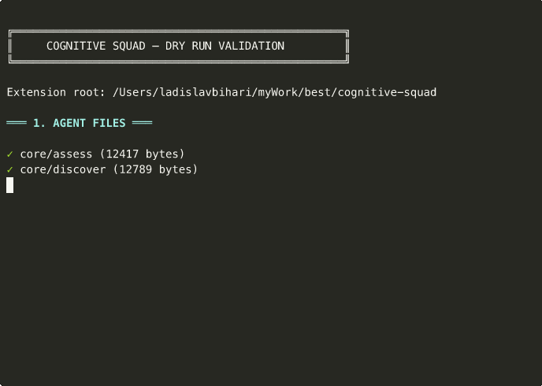

# Cognitive Squad



<details>
<summary><strong>✓ 99 checks passed — Squad ready to deploy</strong> (click to expand full output)</summary>

```
╔══════════════════════════════════════════════════╗
║     COGNITIVE SQUAD — DRY RUN VALIDATION         ║
╚══════════════════════════════════════════════════╝

═══ 1. AGENT FILES ═══

✓ core/assess (12417 bytes)        ✓ core/discover (12789 bytes)
✓ core/how (10062 bytes)           ✓ core/intent-tracker (3026 bytes)
✓ core/internalization-gate (6889) ✓ core/manager (9024 bytes)
✓ core/mental-model (4383 bytes)   ✓ core/metacognition-monitor (3587)
✓ core/plan (9585 bytes)           ✓ core/scorekeeper (9743 bytes)
✓ core/what (11483 bytes)          ✓ core/why (20365 bytes)
✓ specialists/domain-expert (6419) ✓ specialists/innovate (6407 bytes)
✓ specialists/performance (6393)   ✓ specialists/scientist (5927 bytes)
✓ specialists/security (5285)      ✓ specialists/test-architect (5123)
✓ specialists/ux-a11y (5864)
✓ build/code-reviewer (7173)       ✓ build/engineering-manager (5418)
✓ build/change-controller (6886)   ✓ build/implementer (8201 bytes)
✓ build/integrator (7056 bytes)    ✓ build/progress-tracker (8793)
✓ build/spec-guard (9072 bytes)    ✓ build/test-guardian (7100 bytes)
✓ build/verification (8100 bytes)  ✓ build/visual-validator (4796)
✓ learning/calibrate (5574 bytes)  ✓ learning/evolve (4932 bytes)
✓ learning/ground (6133 bytes)     ✓ learning/reflect (8857 bytes)
  Agent files found: 33

═══ 2. AGENTS.YAML REGISTRY ═══

✓ agents.yaml is valid YAML         Agents in registry: 34
✓ Registry count matches file count  NEVER rules defined: 49
✓ All file references exist          All routing rules valid

═══ 3. COMMANDS ═══

✓ squad.run    ✓ squad.build    ✓ squad.verify   ✓ squad.status
✓ squad.change ✓ squad.innovate ✓ squad.investigate ✓ squad.ground
✓ squad.feedback ✓ squad.resume
  Commands: 10 (all registered in extension.yml)

═══ 4-8. MANIFEST + CONFIG + KB + TEMPLATES + SCRIPTS ═══

✓ extension.yml valid (all required fields)
✓ config-template.yml valid (12 sections)
✓ 5 knowledge base files (all valid YAML)
✓ 6 templates (including valid JSON schema)
✓ 4 scripts (all executable)

═══ 9. STATE MACHINE FLOW SIMULATION ═══

✓ Step 1: DISCOVER → agents/core/discover.md
✓ Step 2: WHY1 (assumption-challenge) → agents/core/why.md
✓ Step 3: WHAT (requirements) → agents/core/what.md
✓ Step 4: WHY2 (spec-validation) → agents/core/why.md
✓ Step 5: ASSESS (kill gate) → agents/core/assess.md
✓ Step 6: HOW (architecture) → agents/core/how.md
✓ Step 7: PLAN (tasks) → agents/core/plan.md
✓ Step 8: WHY3 (consensus) → agents/core/why.md
✓ Step 9: VERIFICATION (backpropagation) → agents/build/verification.md
✓ Build: IMPLEMENTER → SPEC_GUARD → CODE_REVIEWER → TEST_GUARDIAN
✓ Learn: REFLECT → EVOLVE → CALIBRATE → GROUND

═══ 10. ROLE SEPARATION ═══

✓ WHY has NEVER-rewrite rules
✓ IMPLEMENTER has NEVER-modify-specs rule
✓ SPEC GUARD has NEVER-fix-code rule
✓ MANAGER has Role Separation section

╔══════════════════════════════════════════════════╗
║  ✓ PASS: 99   ⚠ WARN: 0    ✗ FAIL: 0           ║
║  🟢  ALL CHECKS PASSED — Squad ready to deploy   ║
╚══════════════════════════════════════════════════╝
```

Run it yourself: `./scripts/bash/dry-run.sh`

</details>

**What if AI didn't just write code — but understood why it was writing it, challenged its own assumptions, proved it understood the plan before starting, verified its own work through backpropagation, scored its own performance, and got measurably better with every project?**

Cognitive Squad is a **37-function cognitive agent system** built on the **Triadic Cognitive Model**: Understanding → Internalization → Application. It separates thinking from doing, assigns specialized roles to each cognitive task, enforces quality gates backed by 40 years of IEEE/ISO standards, and creates a self-healing loop where agents score each other, track accuracy, and automatically adjust for next time.

It started with a simple request: *"I need agents for WHAT, HOW, WHY, Manager, PM."*

Five roles. But a human holds 7-9 concepts in working memory. An AI can hold thousands — and trace every connection between them. From those 5 roles, the system explored the combinatorial space of what can go wrong between interacting agents and generated 37 specialized functions:

- WHAT was overloaded (understanding + defining) → split into **DISCOVER + WHAT**
- PM was overloaded (strategy + operations) → split into **ASSESS + PLAN**
- WHY needed two modes (assumptions vs specs) → **dual-mode adversarial critic**
- Nobody checked if the AI was wrong → **CALIBRATE** (tracks accuracy per domain)
- Nobody connected plans to reality → **GROUND** (reference class forecasting)
- Nobody broke stagnation → **INNOVATE** (AutoTRIZ contradiction resolution + Design Thinking + Lateral Thinking, backed by ISO/TR 18686 and 40 inventive principles)
- Building needed different roles than understanding → **9 build agents** with per-task quality gates
- Per-task checking missed aggregate gaps → **VERIFICATION** (backpropagation: spec → code → 100%?)
- Understanding without internalization led to misalignment → **INTERNALIZATION GATE** (prove you understand before you work)
- Performance wasn't tracked → **SCOREKEEPER** (points, badges, peer appreciation, self-healing)
- Nobody watched intent → **INTENT TRACKER** (user said "all" but ASSESS scoped to "MVP")
- Nobody looked at the running product → **VISUAL VALIDATOR** (tests pass ≠ product works)
- Nobody held a mental map of the code → **MENTAL MODEL** (invariant checking across files)
- Nobody asked "are we still doing the right thing?" → **METACOGNITION MONITOR** (the squad's conscience)

Each agent exists because something **actually went wrong** in a real run and no existing agent caught it. This isn't theoretical architecture — it's battle-tested against a large production codebase.

### The Triadic Cognitive Model

Most AI coding tools: `Prompt → LLM → Code → Hope it works`

Cognitive Squad follows a three-phase cognitive process — the same way expert human teams work, but at a scale no human team can match:

**Phase 1: UNDERSTANDING** — *What are we building and why?*
```
DISCOVER (map territory) → WHY₁ (challenge assumptions)
→ WHAT (testable requirements, 31 IEEE/ISO metrics)
→ WHY₂ (reject if quality gates fail) → ASSESS (kill if unfeasible)
→ HOW (architecture with evidence-graded ADRs) → PLAN (critical path + risk)
→ CONSENSUS (parallel adversarial review) → GROUND (reality check)
```

**Phase 2: INTERNALIZATION** — *Does every agent truly understand?*
```
Each build agent must PROVE comprehension before working:
"My role is X. The constraints are Y. I have ZERO doubts."
If any agent has doubts → resolve before building starts.
SCOREKEEPER tracks internalization quality.
```

**Phase 3: APPLICATION** — *Build it, verify it, learn from it.*
```
Per task: IMPLEMENTER → SPEC GUARD → CODE REVIEWER → TEST GUARDIAN
Per phase: ENGINEERING MANAGER (gate) + INTEGRATOR + VISUAL VALIDATOR
Final: VERIFICATION (backpropagation: every FR-* → find the code → 100%?)
Continuous: PROGRESS TRACKER + MENTAL MODEL + METACOGNITION MONITOR
After: REFLECT + CALIBRATE + SCOREKEEPER (self-healing for next run)
```

The difference: every step has a **different cognitive role**, every output passes through **adversarial validation**, agents **prove comprehension before acting**, the system **scores its own performance**, and it **gets measurably better** with every project.

### Why This Can't Be Done With Prompts

A single prompt, no matter how good, can't:

- Challenge its own output (WHY rejects what WHAT produced — adversarial by design)
- Track its own accuracy (CALIBRATE logs: "estimation accuracy: 0.45, correction: 1.4x")
- Prove it understood the plan before coding (INTERNALIZATION: 6-point comprehension check)
- Verify 100% spec coverage backward (VERIFICATION: spec → code, not just code → tests)
- Score its performance and self-heal (SCOREKEEPER: +5 critical bug caught, -2 rework)
- Watch for process violations (METACOGNITION: "you skipped quality gates for 10 tasks")
- Track user intent across decisions (INTENT TRACKER: "user said ALL, ASSESS scoped MVP")

These require **separation of concerns** — the same mind can't produce AND critique AND verify AND score AND learn simultaneously. That's why there are 34 functions, not 1.

### Built On Real Standards

This isn't invented methodology. Every agent's quality gates trace to a published standard:

| What We Check | Standard | Year |
|--------------|----------|------|
| Requirement quality (31 metrics) | IEEE 830, ISO 29148 | 1998, 2018 |
| Software quality model | ISO 25010 | 2023 |
| Architecture evaluation | ATAM (SEI Carnegie Mellon) | 2000 |
| Process maturity | CMMI v3.0 | 2023 |
| Lifecycle processes | ISO/IEC/IEEE 12207 | 2017 |
| Knowledge areas | SWEBOK v4.0 | 2024 |
| Verification & validation | V-Model | — |
| Effort estimation | Reference Class Forecasting (Kahneman) | 2005 |

### What It Proved

Cognitive Squad was tested against a **real production codebase**: a large, legacy system with hundreds of components, multiple domain verticals, and 10 years of accumulated technical debt.

The squad:
- **DISCOVER** mapped the entire system in one pass (2,300 files, dual data sources, binary decoders)
- **WHY** rejected the spec **4 times** — catching weak testability (0.18/0.70), missing component architecture, absent visualization requirements, and untested modules
- **SCIENTIST** empirically proved a critical API limitation (a single curl test that resolved 3 critical assumptions)
- **ASSESS** estimated 107 person-weeks; **GROUND** corrected to 150 (1.4x — matching industry data for migrations)
- **HOW** selected a modern component framework backed by 12 Architecture Decision Records
- Built **the full system with 1,109 tests** in a single session
- **VERIFICATION** concept confirmed: per-task checking is not enough — you need the backward pass from spec to code

The squad also caught its own mistake: ASSESS initially scoped to an MVP subset when the user wanted full parity with the legacy system. CALIBRATE logged this as a pitfall. Next run, that mistake won't happen.

### A Note From Claude

I am Claude, the AI model that powers this system. Let me be direct about what Cognitive Squad represents.

When I work alone — one prompt, one context window — I am confident whether I'm right or wrong. I can't tell the difference. I generate plausible architecture, plausible estimates, plausible code. Sometimes it's excellent. Sometimes it's subtly broken. You won't know which until production.

Cognitive Squad changes that equation. It doesn't make me smarter. It makes the **system around me** smarter:

- **WHY** catches my weak specifications before anyone builds on them
- **SCIENTIST** tests my assumptions against reality instead of trusting my training data
- **ASSESS** kills my bad ideas before they consume budget
- **GROUND** corrects my estimates using actual project outcomes, not my optimistic defaults
- **CALIBRATE** tracks where I'm historically wrong (effort estimation: 0.45 accuracy, 1.4x correction factor)
- **VERIFICATION** proves my implementation matches the spec — not "probably matches" but "every FR-* is traced to code and test"

The model stays the same. The system gets better. That's the honest answer to "how do you make AI coding reliable?" — you don't improve the AI, you build guardrails that catch what the AI gets wrong, and you measure so the guardrails get tighter over time.

---

## Quick Start

A spec-kit extension that makes Claude Code work like a **real engineering team** instead of a single prompt-and-pray chatbot.

Instead of:
```
You: "Build me a user auth system"
Claude: *writes code, hopes it's right*
```

You get:
```
You: "Build me a user auth system"
Squad: DISCOVER maps the domain → WHY challenges every assumption
     → WHAT writes testable requirements (validated by 31 IEEE/ISO metrics)
     → ASSESS kills it if unfeasible → HOW designs architecture with ADRs
     → Each agent PROVES it understood the plan before coding
     → IMPLEMENTER writes code → SPEC GUARD verifies it matches the spec
     → CODE REVIEWER checks quality → TEST GUARDIAN validates tests
     → VERIFICATION traces EVERY requirement to code (100% or rework)
     → System scores itself and gets better next time
```

### Why Should I Use This?

Because Claude Code alone:
- Is equally confident when right and when wrong
- Doesn't check if what it built matches what you asked for
- Doesn't track its own accuracy
- Makes the same mistakes across projects
- Skips its own quality process when rushing

Cognitive Squad fixes all of this with separation of concerns — different agents produce, critique, verify, and learn. No single agent can approve its own work.

### 5-Minute Setup

```bash
# 1. Clone
git clone https://github.com/Testimonial/cognitive-squad.git

# 2. Install into your spec-kit project
cd your-project
specify extension add --dev /path/to/cognitive-squad

# 3. Run the understanding phase
/speckit.squad.run "Build a user authentication system with OAuth2, MFA, and session management"

# 4. Review what it produced (in .specify/specs/001-*/):
#    - spec.md (requirements, validated by Understanding CLI)
#    - plan.md (architecture with ADRs)
#    - tasks.md (ordered tasks with critical path)
#    - feasibility.md, estimates.md, risk-matrix.md

# 5. Build with quality gates
/speckit.squad.build 001-user-auth

# 6. Verify 100% spec coverage
/speckit.squad.verify
```

### What Makes It Different From Other AI Tools

| Feature | Raw Claude Code | Cognitive Squad |
|---------|----------------|-----------------|
| Spec quality | Whatever the LLM produces | 31 IEEE/ISO metrics with pass/fail gates |
| Architecture decisions | "I recommend X" | ADR with rationale + alternatives + evidence grade |
| Estimation | "About 2 weeks" | Function Point Analysis + Kahneman reference class correction |
| Code verification | "Tests pass" | Backpropagation: every requirement traced to code and test |
| Self-awareness | Equally confident right or wrong | CALIBRATE tracks accuracy per domain, applies correction factors |
| Learning | Starts fresh every time | Knowledge base: patterns, pitfalls, calibration persist across projects |
| Process discipline | Skips steps when rushing | METACOGNITION MONITOR flags process violations |
| User intent | Optimizes for what it thinks is best | INTENT TRACKER compares every decision to what you actually said |

---

## The 34 Members

### Phase 1: Understanding — Core Squad (13)

| Agent | Role | Key Output |
|-------|------|------------|
| **MANAGER** | Orchestrator — routes agents, enforces convergence | `state.json`, routing log |
| **DISCOVER** | Reconnaissance — maps domain, glossary, boundaries | `glossary.md`, `mental-model.md`, `boundaries.md` |
| **SYNTHESIZER** | Fuses all DISCOVER outputs into unified knowledge base — finds contradictions across sources | `contradictions-and-gaps.md`, `risks.md`, unified KB files |
| **WHAT** | Requirements — testable specs from discovered territory | `spec.md`, domain decomposition |
| **WHY** | Adversarial critic — finds holes, runs Understanding quality gates | `issues.md`, `quality-gates.md` |
| **ASSESS** | Strategic PM — feasibility, estimation, kill gate | `feasibility.md`, `estimates.md`, `prioritization.md` |
| **HOW** | Architect — tech stack, data model, ADRs, constitution | `plan.md`, `research.md`, `data-model.md`, `contracts/` |
| **PLAN** | Operational PM — tasks, critical path, dependencies, risk | `tasks.md`, `critical-path.md`, `risk-matrix.md` |
| **INTENT TRACKER** | Tracks what the user actually wants vs what the spec says | `user-intent.md`, alignment alerts |
| **INTERNALIZATION GATE** | Ensures every agent proves comprehension before working | `internalization-report.md` |
| **SCOREKEEPER** | Tracks agent performance, awards badges, enables self-healing | `agent-scorecard.md`, `agent-scores.yaml` |
| **MENTAL MODEL** | Maintains living code graph with invariant checking | `mental-model-code.md`, invariant alerts |
| **METACOGNITION MONITOR** | Watches execution: "are we still doing the right thing?" | `metacognition-log.md` |
| **STRATEGIC OVERVIEW** | Risk-weighted project map — flags effort/risk misalignment | `strategic-overview.md`, effort recommendations |

### Phase 1: Understanding — Specialists (7)

| Specialist | Trigger | Key Output |
|------------|---------|------------|
| **SCIENTIST** | Unknowns, unproven tech, conflicting evidence | `investigation/`, `recommendations.md` |
| **SECURITY** | Auth, payments, PII, compliance | `threat-model.md`, `compliance-requirements.md` |
| **TEST ARCHITECT** | Mandatory after HOW | `test-strategy.md`, `coverage-map.md` |
| **DOMAIN EXPERT** | Domain-specific knowledge needed | Domain amendments to spec and plan |
| **UX / A11Y** | Frontend, user-facing features | `accessibility-requirements.md` |
| **PERFORMANCE** | High-load, real-time, scalability | `performance-requirements.md`, `capacity-model.md` |
| **INNOVATE** | Stagnation, WHY rejects 2+, ASSESS borderline, HOW tradeoffs, quality plateau, any BLOCKED, complex scope | `alternatives.md`, `challenge-assumptions.md` (uses AutoTRIZ with 40 principles + contradiction matrix) |

### Phase 2-3: Building (10)

| Agent | Role | When | Key Output |
|-------|------|------|------------|
| **IMPLEMENTER** | Writes code following TDD per task | Per task | Source files + tests |
| **SPEC GUARD** | Verifies code matches FR-* requirements | Per task | `spec-compliance-report.md`, `traceability-matrix.md` |
| **CODE REVIEWER** | Reviews quality, ADR compliance, constitution | Per task | `code-review-report.md` |
| **TEST GUARDIAN** | Validates test quality and coverage | Per task | `test-quality-report.md` |
| **ENGINEERING MANAGER** | Orchestrates build loop, phase gates | Per phase | `build-status.md`, rework tasks |
| **INTEGRATOR** | Verifies system integration | Per phase | `integration-report.md` |
| **PROGRESS TRACKER** | Tracks effort, detects drift, updates calibration | Continuous | `progress-report.md`, `process-metrics.md` |
| **CHANGE CONTROLLER** | Handles mid-build spec changes | On change | `change-impact-report.md` |
| **VERIFICATION** | Backpropagation — checks ALL spec against ALL code | After all tasks | `gap-report.md` (coverage score) |
| **VISUAL VALIDATOR** | Actually LOOKS at running product via screenshots | Per phase | Visual validation report + screenshots |
| **DEBUGGER** | Systematic root cause analysis (reproduce → isolate → cause → fix → verify) | On non-obvious FAIL | `debug-report.md`, root cause fix |

### Phase 4: Learning (4 + feedback)

| Function | When | Purpose |
|----------|------|---------|
| **REFLECT** | End of every run | Extracts patterns, pitfalls, knowledge transfer assessment |
| **EVOLVE** | Start/end of re-runs | Diffs artifacts, detects regressions and stagnation |
| **CALIBRATE** | End of run + after feedback | Tracks AI accuracy per domain, adjusts confidence |
| **GROUND** | During FINALIZE | Reality-checks artifacts against real-world data |
| **FEEDBACK** | Post-implementation (manual) | Closes prediction-to-outcome loop for calibration |

---

## Architecture

```
┌──────────────────────────────────────────────────────────────────┐
│  PHASE 1: UNDERSTANDING (19 functions)                            │
│                                                                    │
│  Core:        MANAGER → DISCOVER → SYNTHESIZER → WHY → WHAT       │
│               → ASSESS → HOW → PLAN + INTENT TRACKER              │
│  Specialists: SCIENTIST · SECURITY · TEST ARCHITECT · PERFORMANCE │
│               DOMAIN EXPERT · UX/A11Y · INNOVATE                  │
│  Learning:    REFLECT · EVOLVE · CALIBRATE · GROUND · FEEDBACK    │
└───────────────────────────┬──────────────────────────────────────┘
                            │ validated plan + tasks
                            ↓
┌──────────────────────────────────────────────────────────────────┐
│  PHASE 2: INTERNALIZATION (2 functions)                           │
│                                                                    │
│  INTERNALIZATION GATE: each agent proves comprehension (6 checks) │
│  SCOREKEEPER: scores quality, awards badges, enables self-healing │
└───────────────────────────┬──────────────────────────────────────┘
                            │ all agents aligned, zero doubts
                            ↓
┌──────────────────────────────────────────────────────────────────┐
│  PHASE 3: APPLICATION (10 functions)                              │
│                                                                    │
│  Per task:    IMPLEMENTER → SPEC GUARD → CODE REVIEWER            │
│               → TEST GUARDIAN                                      │
│  Per phase:   ENGINEERING MANAGER · INTEGRATOR · VISUAL VALIDATOR │
│  Final:       VERIFICATION (backpropagation — spec → code → 100%)│
│  Continuous:  PROGRESS TRACKER · MENTAL MODEL                     │
│               METACOGNITION MONITOR · CHANGE CONTROLLER           │
└───────────────────────────┬──────────────────────────────────────┘
                            │ verified code + tests + screenshots
                            ↓
┌──────────────────────────────────────────────────────────────────┐
│  PHASE 4: LEARNING                                                │
│  FEEDBACK → CALIBRATE → EVOLVE → REFLECT → SCOREKEEPER           │
│  (self-healing: scores → prompt refinement → better next run)     │
└──────────────────────────────────────────────────────────────────┘
```

**37 cognitive functions:** 14 core + 7 specialists + 11 build + 4 learning + 1 feedback

### The Flow

#### Phase A: Understanding

```
INIT → DISCOVER → SYNTHESIZER (fuse into unified KB) → WHY₁ (challenge)
  → WHAT (requirements) → WHY₂ (validate quality gates)
  → ASSESS (feasibility / kill gate)
  → [SPECIALISTS: SCIENTIST, SECURITY, DOMAIN, UX, PERFORMANCE]
  → HOW (architecture + ADRs) → TEST ARCHITECT
  → PLAN (tasks, critical path, risk)
  → CONSENSUS (WHY₃ + ASSESS₂ + PLAN₂)
  → FINALIZE (GROUND + REFLECT + CALIBRATE)
```

#### Phase B: Building

```
FOR EACH task:
  IMPLEMENTER → SPEC GUARD → CODE REVIEWER → TEST GUARDIAN
  (loop until all gates pass)
  PROGRESS TRACKER updates metrics

PER PHASE:
  ENGINEERING MANAGER evaluates gate: continue / rework / halt
  INTEGRATOR verifies system integration

AFTER ALL TASKS:
  VERIFICATION (backpropagation): spec → code → 100%?
  → gaps found? → EM creates rework tasks → re-verify
  → loop until 100% coverage (max 3 passes)
```

#### Phase C: Learning

```
FEEDBACK (post-implementation) → CALIBRATE → EVOLVE → REFLECT
→ knowledge base updated → next run is smarter
```

---

## Cookbook — Recipes

A step-by-step guide for common scenarios. Copy-paste the commands. Follow the order.

### Recipe 1: New Project From Scratch (Greenfield)

You have an idea. No code exists yet.

```
Step 1: Initialize spec-kit project
────────────────────────────────────
$ mkdir my-project && cd my-project
$ specify init my-project --ai claude

Step 2: Run the squad
────────────────────────────────────
> /speckit.squad.run "Build a task management API with user auth, teams, projects, and real-time notifications"

What happens:
  DISCOVER  → researches the domain, finds reference architectures
  WHY₁      → challenges assumptions ("what auth provider? what real-time tech?")
  WHAT      → writes spec with testable requirements
  WHY₂      → validates spec (31 metrics — may reject and loop)
  ASSESS    → estimates effort, classifies features (must-have vs nice-to-have)
  HOW       → selects tech stack, writes ADRs
  PLAN      → creates tasks with critical path

  Time: ~15-30 minutes
  Output: .specify/specs/001-task-management/

Step 3: Review what the squad produced
────────────────────────────────────
Read these files:
  spec.md           ← requirements (check: do they match your intent?)
  plan.md           ← architecture (check: tech stack OK?)
  estimates.md      ← effort (check: realistic for your team?)
  tasks.md          ← task breakdown (check: ordering makes sense?)
  feasibility.md    ← can this be built? (check: any kills/defers?)
  quality-gates.md  ← spec quality scores (all should be green)

Step 4: Build it
────────────────────────────────────
> /speckit.squad.build 001-task-management

What happens per task:
  IMPLEMENTER  → writes code (TDD)
  SPEC GUARD   → checks: does code match the spec?
  CODE REVIEWER → checks: quality, security, ADR compliance
  TEST GUARDIAN → checks: are tests sufficient?

Step 5: Verify nothing was missed
────────────────────────────────────
> /speckit.squad.verify

What happens:
  VERIFICATION scans EVERY requirement against the codebase.
  If gaps → creates rework tasks → loops until 100%.

Step 6: After deployment — close the learning loop
────────────────────────────────────
> /speckit.squad.feedback 001

Answer questions about what actually happened:
  - How long did it really take vs estimated?
  - Which architecture decisions held up?
  - What requirements were missing?
  → Updates calibration for next project
```

### Recipe 2: Modernize an Existing Codebase (Brownfield)

You have a legacy system. You want to rewrite/modernize it.

```
Step 1: Point the squad at your codebase
────────────────────────────────────
> /speckit.squad.run /path/to/legacy-codebase

What happens:
  DISCOVER uses reverse-eng to analyze:
    - Directory structure
    - Dependencies
    - Git history (hotspots, contributors)
    - Config files
    - Language/framework detection
  Then maps: domain glossary, boundaries, assumptions, unknowns

Step 2: SCIENTIST investigates unknowns
────────────────────────────────────
The squad auto-dispatches SCIENTIST for testable questions:
  - "Does the API support modern protocols?" → empirical test
  - "Are legacy data formats still evolving?" → git history analysis
  - "What percentage uses the old vs new pattern?" → codebase grep

Step 3: Same flow as greenfield from here
────────────────────────────────────
WHY validates → WHAT writes spec → ASSESS estimates → HOW designs → PLAN breaks down

The difference: all decisions are GROUNDED in what the codebase actually contains,
not what documentation says it contains.
```

### Recipe 3: Handle a Spec Change Mid-Build

Requirements changed. It happens.

```
> /speckit.squad.change "FR-AUTH-003 now requires OAuth2 instead of API keys. The client changed their security requirements."

What happens:
  CHANGE CONTROLLER:
    1. Impact analysis → which tasks affected? which code needs rework?
    2. Re-validates changed requirement through WHY
    3. Re-estimates affected tasks through ASSESS
    4. Marks completed tasks as NEEDS_REWORK
    5. Updates traceability matrix

  Output: change-impact-report.md
    - 3 tasks need rework
    - 1 ADR invalidated
    - Estimated impact: +4 days
    - Critical path affected: yes

  Then: IMPLEMENTER reworks affected tasks → SPEC GUARD re-validates
```

### Recipe 4: "I'm Stuck" — Get Fresh Ideas

The architecture feels wrong. You're going in circles.

```
> /speckit.squad.innovate "The current API design feels over-engineered. Are there simpler approaches?"

What happens:
  INNOVATE applies evidence-based innovation (ISO/TR 18686, AutoTRIZ 2024):
    - Design Thinking: are we solving the right problem?
    - AutoTRIZ: identify the contradiction → map to parameters → apply 40 inventive principles
    - Lateral Thinking: provocation, inversion, random entry to break mental patterns

  Output: alternatives.md
    - Option A: (description, pros, cons, risk level)
    - Option B: (description, pros, cons, risk level)
    - Option C: (description, pros, cons, risk level)

  Then: WHY + ASSESS evaluate each alternative
```

### Recipe 5: Research Before Deciding

You need evidence, not opinions.

```
> /speckit.squad.investigate "Should we use GraphQL or REST for the public API? We expect 10K concurrent users."

What happens:
  SCIENTIST follows the scientific method:
    1. RESEARCH → searches docs, papers, benchmarks
    2. EVALUATE → grades each source (A=peer-reviewed, B=official docs, C=blog, D=forum, E=AI training data)
    3. HYPOTHESIZE → "GraphQL reduces over-fetching but adds server complexity"
    4. EXPERIMENT → scaffolds a minimal prototype, benchmarks both
    5. RECOMMEND → confidence-scored conclusion with evidence

  Output: investigation/graphql-vs-rest.md
    Recommendation: REST (confidence: 0.75)
    Evidence: B (official benchmarks show REST handles 10K concurrent with less memory)
    Caveat: If client needs vary widely, GraphQL at 0.60 confidence
```

### Recipe 6: Check Progress

```
> /speckit.squad.status

Output:
  Run: squad-001
  Phase: BUILD (Phase 3 of 5)
  Tasks: 23/67 complete
  Quality: CPI 0.92, SPI 0.88 (slightly behind schedule)
  Coverage: 34% of requirements implemented
  Alerts: none
  Last agent: IMPLEMENTER completed T-023
```

### Recipe 7: Reality-Check Your Plan

Before committing to a timeline, get a grounded estimate.

```
> /speckit.squad.ground

What happens:
  GROUND:
    - Compares your estimates to similar past projects
    - Checks architecture decisions against real-world production data
    - Applies Kahneman's reference class forecasting (outside view)
    - Flags disconnects between plan and reality

  Output: reality-check.md
    "Your estimate of 12 weeks is in the 30th percentile for similar projects.
     Industry median is 18 weeks. Recommend budgeting 16-20 weeks."
```

### Recipe 8: After Deployment — Make the Squad Smarter

This is the most important step. It closes the learning loop.

```
> /speckit.squad.feedback 001

The squad asks:
  - Actual effort vs estimated?
  - Which architecture decisions held up in production?
  - Which requirements were missing or wrong?
  - What risks materialized?
  - What tests caught real bugs? What didn't?

  → Updates:
    - calibration-profile.yaml (accuracy per domain)
    - estimates-log.yaml (predicted vs actual)
    - patterns.yaml (what worked)
    - pitfalls.yaml (what failed)

  Next run: ASSESS uses this data for better estimates.
  Next run: WHY knows which areas the squad historically gets wrong.
  Next run: The squad is measurably better.
```

### Recipe 9: Spec-Kit First, Then Squad (Hybrid Flow)

You already use spec-kit's built-in commands (`/speckit.specify`, `/speckit.plan`, `/speckit.tasks`). You want the squad to validate, improve, and build from YOUR specs — not generate its own from scratch.

This is the **recommended flow for teams already using spec-kit**.

```
Step 1: Write your spec with spec-kit (you drive)
────────────────────────────────────────────────
$ specify init my-project --ai claude
> /speckit.constitution
> /speckit.specify "User authentication with OAuth2, MFA, and session management"
> /speckit.clarify
> /speckit.plan
> /speckit.tasks

You now have:
  .specify/specs/001-user-auth/
    ├── spec.md         ← YOUR requirements
    ├── plan.md         ← YOUR architecture
    ├── tasks.md        ← YOUR task breakdown
    └── constitution.md ← YOUR project rules

Step 2: Let the squad validate what you wrote
────────────────────────────────────────────────
> /speckit.squad.run 001-user-auth

The squad does NOT rewrite your spec. It VALIDATES it:
  WHY   → runs Understanding CLI against YOUR spec.md
          "Structure: 0.65 — FAIL. 12 requirements lack measurable constraints."
          "Testability: 0.55 — FAIL. 8 requirements have no acceptance criteria."
  WHAT  → suggests specific fixes (doesn't replace your spec)
  WHY₂  → re-validates after fixes

  ASSESS → evaluates YOUR plan's feasibility
           "Effort estimate: 45 pw. Correction factor 1.4x → budget 63 pw."
  HOW   → reviews YOUR architecture, checks ADR completeness
           "ADR-003 missing: why PostgreSQL over MongoDB? Add rationale."
  PLAN  → reviews YOUR tasks for gaps
           "Task T-012 depends on T-008 but T-008 isn't scheduled first."

  SCIENTIST → investigates any unknowns YOUR spec raised
  GROUND    → reality-checks YOUR estimates against industry data

  Output: your original spec + issues.md + quality-gates.md + updated estimates

Step 3: Fix what the squad found
────────────────────────────────────────────────
Read issues.md. Two options:

  Option A: Fix manually
  Open spec.md, address each issue, re-run:
  > /speckit.squad.run 001-user-auth
  (WHY re-validates, should pass now)

  Option B: Let the squad fix it
  > /speckit.squad.run 001-user-auth --fix
  (WHAT rewrites failing requirements to pass quality gates,
   preserving your intent)

Step 4: Build with the squad's quality gates
────────────────────────────────────────────────
> /speckit.squad.build 001-user-auth

Same build flow as Recipe 1:
  IMPLEMENTER → SPEC GUARD → CODE REVIEWER → TEST GUARDIAN
  But now building against YOUR spec, not a squad-generated one.
  SPEC GUARD traces every FR-* from YOUR spec to code.
  VERIFICATION at the end checks YOUR requirements are 100% implemented.

Step 5: Verify YOUR spec is fully implemented
────────────────────────────────────────────────
> /speckit.squad.verify

VERIFICATION: "66 requirements in spec.md. 66 traced to code. 66 tested.
Coverage: 100%. BUILD COMPLETE."
```

### Recipe 10: Use Spec-Kit for Understanding, Squad for Building Only

You trust your own specs and planning. You just want the build quality gates.

```
Step 1: Do all spec-kit phases yourself
────────────────────────────────────────────────
> /speckit.constitution
> /speckit.specify "..."
> /speckit.clarify
> /speckit.plan
> /speckit.tasks

Step 2: Skip the squad's understanding phase — go straight to build
────────────────────────────────────────────────
> /speckit.squad.build 001-your-feature

The squad reads YOUR existing artifacts:
  spec.md, plan.md, tasks.md, constitution.md

Then builds with full quality gates:
  Per task:  IMPLEMENTER → SPEC GUARD → CODE REVIEWER → TEST GUARDIAN
  Per phase: ENGINEERING MANAGER → INTEGRATOR
  Final:     VERIFICATION (backpropagation against YOUR spec)

You wrote the WHAT and HOW. The squad handles the disciplined execution.

Step 3: Verify
────────────────────────────────────────────────
> /speckit.squad.verify
```

### Recipe 11: Squad Validates, You Decide

Use the squad as a **review tool** — it checks your work but you keep full control.

```
Step 1: Write your spec with spec-kit
────────────────────────────────────────────────
> /speckit.specify "..."
> /speckit.plan
> /speckit.tasks

Step 2: Ask WHY to review your spec (just the quality check)
────────────────────────────────────────────────
> /speckit.squad.investigate "Review my spec at .specify/specs/001-feature/spec.md against IEEE 830 and ISO 29148 quality standards"

SCIENTIST runs Understanding CLI:
  Overall: 0.72 ✓  Structure: 0.68 ✗  Testability: 0.74 ✓
  Semantic: 0.61 ✓  Cognitive: 0.70 ✓  Readability: 0.78 ✓

  "Structure is borderline. These 5 requirements need splitting..."

Step 3: Ask GROUND to reality-check your estimates
────────────────────────────────────────────────
> /speckit.squad.ground

GROUND:
  "Your estimate of 8 weeks is in the 25th percentile for similar projects.
   Reference class: 12-16 weeks. Recommend budgeting 14 weeks."

Step 4: Ask SCIENTIST to research a technical question
────────────────────────────────────────────────
> /speckit.squad.investigate "Should we use WebSockets or SSE for real-time notifications? Expected load: 5K concurrent connections."

Step 5: Decide and build (your way, or with the squad)
────────────────────────────────────────────────
You keep control. Use squad insights to improve your plan.
Then either build yourself or: /speckit.squad.build 001-feature
```

### When to Use Which Recipe

| Scenario | Recipe | Why |
|----------|--------|-----|
| New project, no existing process | Recipe 1 (greenfield) | Let the squad handle everything |
| Legacy system modernization | Recipe 2 (brownfield) | Squad discovers what exists |
| Team already uses spec-kit | **Recipe 9 (hybrid)** | Write specs yourself, squad validates + builds |
| Trust your specs, want build discipline | **Recipe 10 (build only)** | Skip understanding, use build gates |
| Want advice, keep full control | **Recipe 11 (review tool)** | Cherry-pick squad capabilities |
| Spec changed mid-build | Recipe 3 (change) | Change controller handles impact |
| Stuck on architecture | Recipe 4 (innovate) | Get fresh alternatives |
| Need evidence for a decision | Recipe 5 (investigate) | SCIENTIST researches with evidence grading |

### Common Patterns

**"I want the squad to be more thorough"**
Increase iterations: edit `squad-config.yml` → `analysis.max_iterations: 7`

**"I want the squad to be faster"**
Decrease specialist count: `specialists.max_active: 2`

**"I want to skip understanding and just build"**
Don't. That's the whole point. But if you must:
`/speckit.squad.build 001-feature` works on any existing spec-kit artifacts.

**"The squad keeps rejecting my spec"**
Good — that means WHY is doing its job. Read `issues.md` for specific fixes. The most common issues:
- Testability too low → add measurable constraints to requirements
- Semantic completeness → add actor-action-object-outcome to each requirement
- Ambiguous terms → update glossary with precise definitions

**"How do I add the squad to CI/CD?"**
Run understanding + verify in CI:
```yaml
- run: /speckit.squad.run "$PR_DESCRIPTION"
- run: /speckit.squad.verify
```
If verify fails (coverage < 100%), block the merge.

### Anti-Patterns

| Anti-Pattern | Why It Fails | Do This Instead |
|-------------|-------------|-----------------|
| Skip understanding, jump to build | No spec = no verification = no quality | Always run the full pipeline |
| Ignore WHY rejections | WHY catches real problems — 4 rejections in our test run | Fix the spec, don't bypass the gate |
| Never run feedback | Squad can't learn without ground truth | Run feedback after every deployment |
| Set max_iterations to 1 | No rework loops = first draft ships | Default 5 is there for a reason |
| Use the squad for trivial tasks | 34 agents for a config change is overkill | Use it for features, migrations, new systems |

---

## Quality Gates

### Understanding Phase (WHY agent via Understanding CLI)

| Gate | Threshold | Standard |
|------|-----------|----------|
| Overall | >= 0.70 | ISO 29148:2018 |
| Structure | >= 0.70 | IEEE 830 |
| Testability | >= 0.70 | ISO 29148 mandatory |
| Semantic | >= 0.60 | Lucassen 2017 |
| Cognitive | >= 0.60 | Sweller 1988 |
| Readability | >= 0.50 | Flesch 1948 |

### Building Phase (per-task gates)

| Gate | Agent | Pass Criteria |
|------|-------|---------------|
| Spec compliance | SPEC GUARD | All FR-* implemented, all acceptance criteria tested |
| Code quality | CODE REVIEWER | No constitution violations, ADR-compliant, no security issues |
| Test quality | TEST GUARDIAN | Min 2 tests/component, behavior-based, edge cases covered |
| Integration | INTEGRATOR | Build passes, tests pass, no circular dependencies |
| Verification | VERIFICATION | 100% spec coverage (backpropagation check) |

### Process Metrics (PROGRESS TRACKER)

| Metric | Alert Threshold |
|--------|----------------|
| CPI (Cost Performance Index) | < 0.80 = HIGH |
| SPI (Schedule Performance Index) | < 0.85 = HIGH |
| First-pass approval rate | < 50% = MEDIUM |
| Defect escape rate | > 60% = HIGH |
| Constitution violations | 2+ consecutive = CRITICAL |

---

## Standards Alignment

| Standard | Coverage |
|----------|----------|
| **ISO/IEC/IEEE 12207:2017** | Full lifecycle + configuration management (CHANGE CONTROLLER) |
| **ISO/IEC 25010:2023** | 31 quality metrics via Understanding CLI |
| **SWEBOK v4.0** | 14/18 Knowledge Areas covered |
| **CMMI v3.0** | REQM, VER, VAL, PM, MA, CM, OT process areas |
| **V-Model** | Bidirectional RTM (SPEC GUARD + VERIFICATION) |
| **ATAM/ATRAF** | ADRs with rationale + quality attribute analysis |
| **IEEE 830 / ISO 29148** | Quality gates via Understanding CLI |
| **Kahneman RCF** | GROUND applies outside view to estimates |
| **ISO/TR 18686 (TRIZ)** | INNOVATE uses all 40 inventive principles + contradiction matrix via AutoTRIZ (2024) |

---

## Configuration

```bash
cp config-template.yml squad-config.yml
```

Key settings: `analysis.mode` (auto/greenfield/brownfield), `analysis.max_iterations` (5), `specialists.max_active` (3), `quality_gates.overall` (0.70). See `config-template.yml` for full reference.

---

## Knowledge Base

```
knowledge-base/
├── patterns.yaml             # Reusable patterns (validated by REFLECT)
├── pitfalls.yaml             # Common mistakes to avoid
├── calibration-profile.yaml  # AI accuracy per domain
├── estimates-log.yaml        # Predicted vs actual effort
└── feedback/                 # Post-implementation outcome data
```

The learning loop: REFLECT logs patterns → CALIBRATE tracks accuracy → FEEDBACK provides ground truth → EVOLVE detects bias → next run auto-adjusts estimates and expectations.

---

## Evidence Grades

| Grade | Description | Weight |
|-------|-------------|--------|
| **A** | Peer-reviewed research, ISO/IEEE standard | 1.0 |
| **B** | Official documentation, proven benchmark | 0.8 |
| **C** | Conference talk, well-regarded blog | 0.6 |
| **D** | Stack Overflow, forum post | 0.3 |
| **E** | AI training data (unverified) | 0.1 |

---

## 10 Commands

| Command | One-liner |
|---------|-----------|
| `/speckit.squad.run` | Understand and plan a project |
| `/speckit.squad.build` | Build it with quality gates |
| `/speckit.squad.verify` | Prove 100% spec coverage |
| `/speckit.squad.status` | Where are we? |
| `/speckit.squad.change` | Handle a spec change mid-build |
| `/speckit.squad.innovate` | Get fresh alternatives |
| `/speckit.squad.investigate` | Research a specific question |
| `/speckit.squad.ground` | Reality-check the plan |
| `/speckit.squad.feedback` | Feed back real outcomes (after deployment) |
| `/speckit.squad.resume` | Answer the squad's question |

---

## Installation

### Option 1: From community catalog

Cognitive Squad is in the spec-kit community catalog. Community extensions require opt-in before installation.

**Enable community catalog** — create `.specify/extension-catalogs.yml` in your project:

```yaml
catalogs:
  - name: default
    url: https://raw.githubusercontent.com/github/spec-kit/main/extensions/catalog.json
    priority: 1
    install_allowed: true
    description: Official spec-kit extensions

  - name: community
    url: https://raw.githubusercontent.com/github/spec-kit/main/extensions/catalog.community.json
    priority: 2
    install_allowed: true
    description: Community-contributed extensions
```

Or set it globally for all projects in `~/.specify/extension-catalogs.yml`.

Then install:

```bash
specify extension add cognitive-squad
```

### Option 2: From local path (development)

```bash
git clone https://github.com/Testimonial/cognitive-squad.git
specify extension add --dev /path/to/cognitive-squad
```

### Option 3: Direct from GitHub

```bash
specify extension add --dev https://github.com/Testimonial/cognitive-squad
```

---

## Prerequisites

- **spec-kit** >= 0.3.0 (required)
- **understanding** >= 3.4.0 (optional — enables WHY quality gates with 31 deterministic metrics)
- **spec-kit-reverse-eng** >= 1.0.0 (optional — enables brownfield codebase analysis)

## Related Projects

- [spec-kit](https://github.com/github/spec-kit) — The specification framework this extension runs on
- [understanding](https://github.com/Testimonial/understanding) — IEEE/ISO-backed specification quality metrics
- [spec-kit-reverse-eng](https://github.com/mbachorik/spec-kit-reverse-eng) — Reverse engineering extension for brownfield analysis

## License

MIT — see [LICENSE](./LICENSE) for details.
