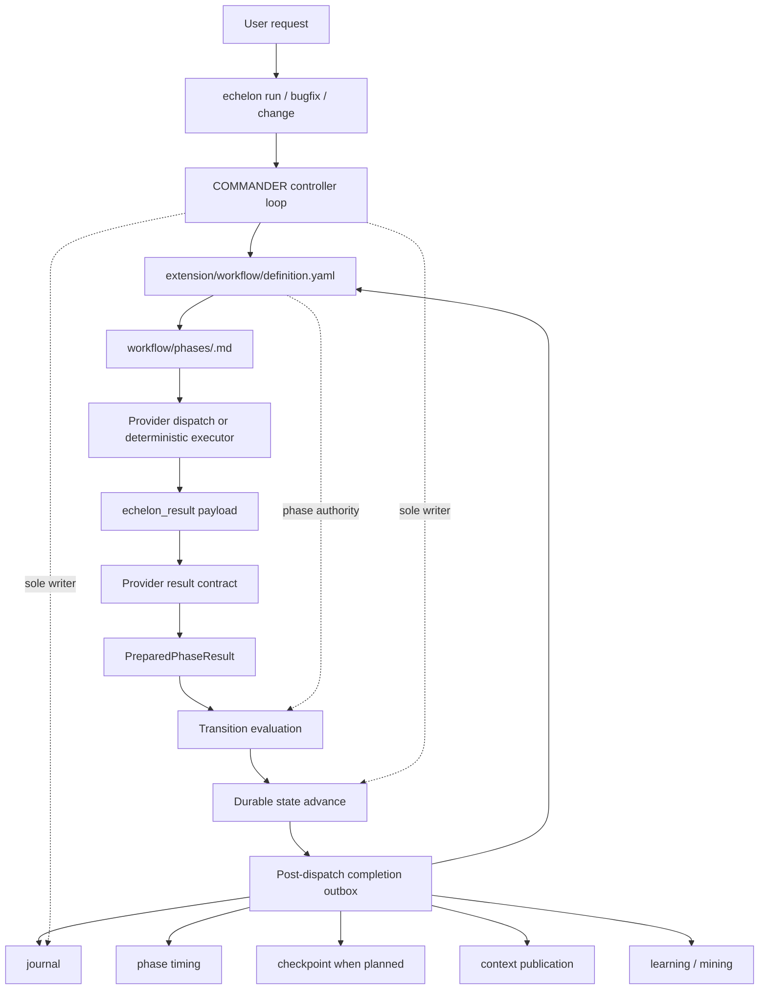
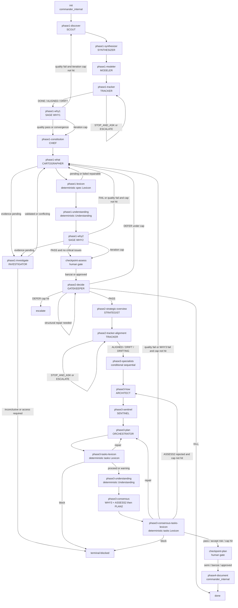
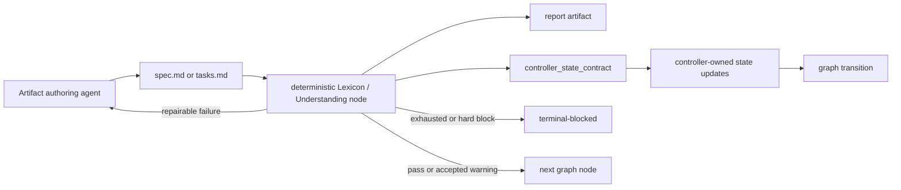
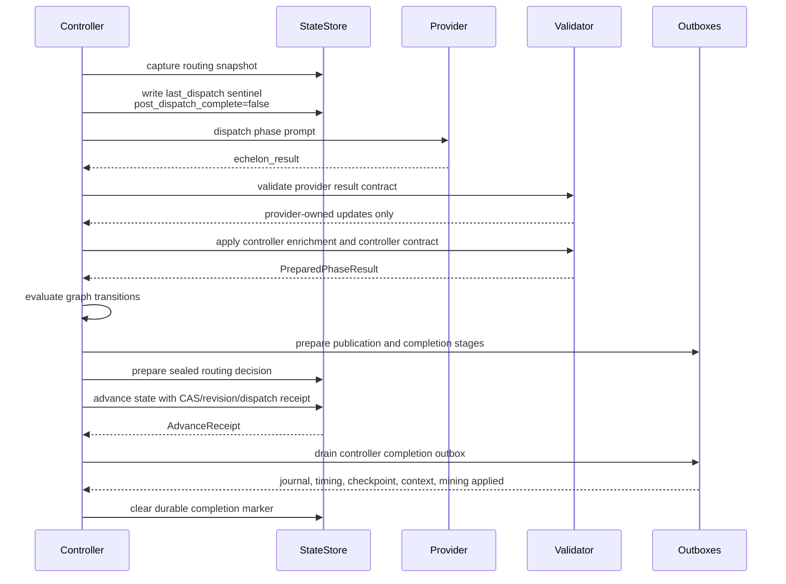
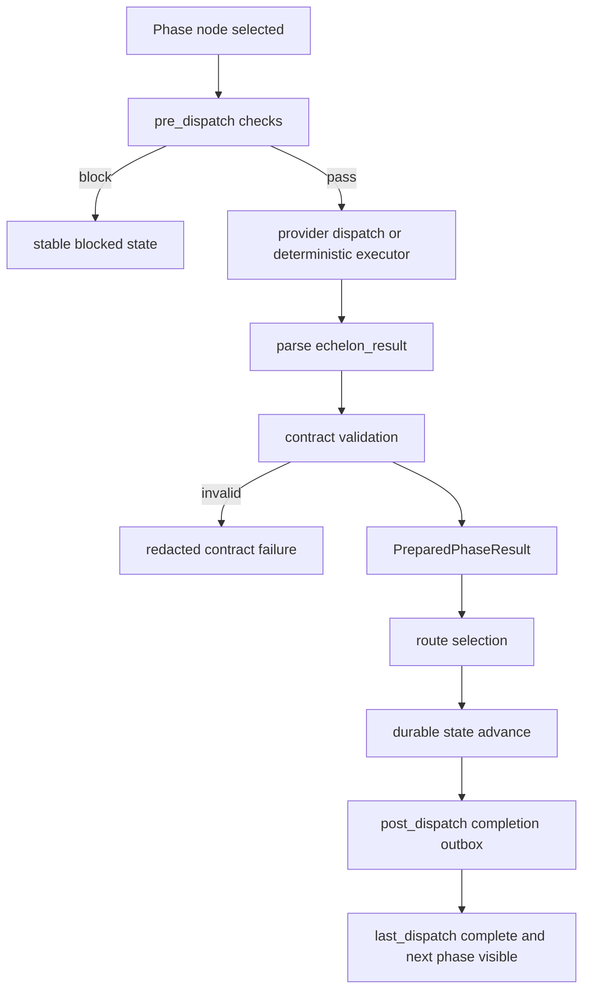
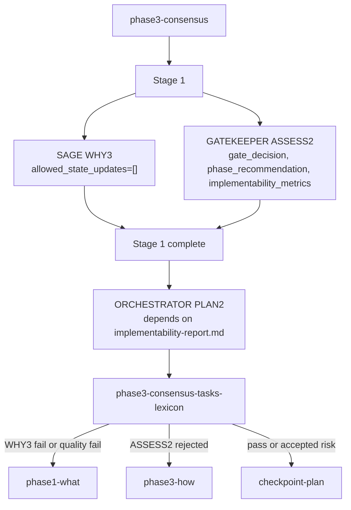
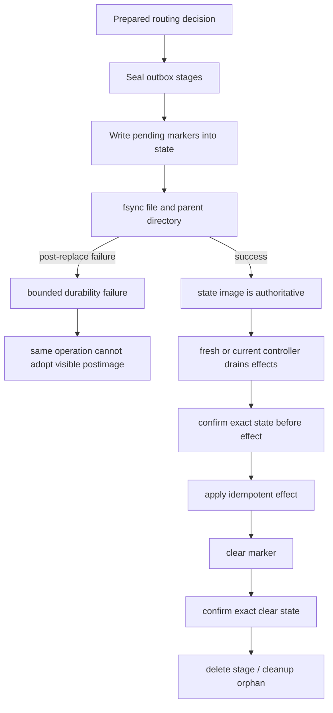
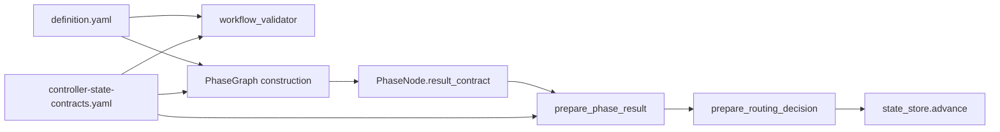

# Echelon Workflow and Controller Hardening

Generated: 2026-07-24

This document describes the current Echelon workflow from the perspective of
EGR stability work: phase graph shape, deterministic nodes, gates, loops, and
the controller dispatch lifecycle. It focuses on the hardening that moved state
authority, certification, routing, and recovery away from broad agent judgment
and into explicit controller contracts.

Primary source files:

- `extension/workflow/definition.yaml`
- `extension/workflow/controller-state-contracts.yaml`
- `extension/workflow/phases/*.md`
- `src/harness/phase_graph.py`
- `src/harness/prepared_phase_result.py`
- `src/harness/squad.py`
- `src/harness/squad_completion.py`
- `src/harness/squad_publication.py`
- `src/harness/phase_checkpoints.py`

## Stabilization Goal

The hardening work keeps Echelon stable by making workflow progress boring in
the best possible way:

- the workflow graph is the visible phase-order authority;
- deterministic certification phases are provider-free nodes;
- provider agents can only update declared provider-owned state keys;
- controller-owned state is produced by controller code and validated through
  reusable contracts;
- routing is selected from a sealed prepared result, not from a mutable live
  payload;
- post-dispatch effects are durable, replayable, and idempotent;
- failures at authority boundaries block or retry without inventing state.

The most important architectural rule is still the old one, just enforced more
strictly now: COMMANDER is the only writer to `state.json` and the reasoning
journal. Other agents return structured `echelon_result` payloads. The
controller validates, prepares, routes, persists, and records the outcome.

## Workflow Ownership Model

The command wrappers stay thin. They load COMMANDER and the workflow graph.
Phase behavior lives in `definition.yaml` plus per-phase dispatcher files under
`extension/workflow/phases/`. Agent files own invariant role protocol, not
phase routing.

## Main Phase A Workflow

The current Phase A graph is no longer the old compressed
`SCOUT -> SAGE -> CARTOGRAPHER` story. It includes explicit synthesis,
modeling, tracking, deterministic Lexicon, deterministic Understanding,
human gates, and post-plan validation.

## Node Types

| Type | Owner | Purpose | Stability property |
| --- | --- | --- | --- |
| `commander_internal` | Controller | Local setup, finalization, publication, bookkeeping | No provider call required |
| `agent` | Provider plus controller | One concrete role dispatch | Provider output is validated before state mutation |
| `deterministic_lexicon` | Controller | Validate derived Lexicon artifacts | No model-owned certification state |
| `deterministic_understanding` | Controller | Run deterministic requirements-quality analysis | Structured controller-owned evidence |
| `conditional_sequential` | Controller | Evaluate possible specialist dispatches one at a time | Each selected dispatch has its own contract |
| `staged_parallel` | Controller | Run a staged fan-out with explicit stage dependencies | Stage 2 waits for Stage 1 outputs |
| `human_gate` | User or autonomy policy | Pause or auto-proceed by configured autonomy | Gate is a visible graph node |
| `terminal` | Controller | End state | No further dispatch |

The hardening work did not try to remove agents. It reduced what any one
dispatch is allowed to decide. Broad roles can still reason, but their state
effects pass through narrow contracts.

## Deterministic Certification Nodes

The strongest pattern is now visible in the workflow:

Current controller-owned contracts:

| Contract | Used by | Controller-owned state |
| --- | --- | --- |
| `spec_lexicon` | `phase1-lexicon` | `lexicon_evaluation`, `lexicon_pass`, `lexicon_attempts`, `lexicon_findings`, `lexicon_report`, `lexicon_warning_waiver`, `blocked_reason` |
| `tasks_lexicon` | `phase3-tasks-lexicon`, `phase3-consensus-tasks-lexicon` | `tasks_lexicon_action`, `tasks_lexicon_pass`, `tasks_lexicon_attempts`, `tasks_lexicon_findings`, `tasks_lexicon_report`, `blocked_reason` |
| `understanding` | `phase1-understanding`, `phase3-understanding` | `quality_scores`, `understanding_evidence`, `blocked_reason` |
| `feasibility_structural` | `phase2-decide` | structural feasibility pass/attempt/report fields |
| `intent_alignment_structural` | `phase2-tracker-alignment` | structural intent-alignment pass/attempt/report fields |

For controller-bearing phases, `allowed_state_updates` must be an explicit
finite list and must not overlap the controller-owned keys. Provider-owned
state and controller-owned state are intentionally separate.

## Dispatch Lifecycle

Each provider dispatch is treated as a transaction. The result is detached,
canonicalized, validated, prepared, routed, advanced, and completed. The live
state is not changed by the provider payload directly.

The `last_dispatch` sentinel is the compaction and crash recovery guard. It is
written before dispatch and completed after post-dispatch processing. If a run
restarts with `post_dispatch_complete=false`, the controller can identify the
unfinished phase and avoid pretending the dispatch completed cleanly.

## Pre-Dispatch and Post-Dispatch

`pre_dispatch` belongs to the phase graph and phase dispatcher contract. It is
used for controller-side checks or setup before invoking an agent. Examples
include guardian mode checks, stale configuration protection, artifact
readiness, and runtime policy validation.

`post_dispatch` is the controller completion protocol. It is not an agent's
private cleanup step. It is where the controller applies durable effects that
follow a sealed route.

The hardening moved post-dispatch side effects behind durable markers. If the
controller crashes after state advance but before all effects finish, a fresh
controller first confirms the exact loaded state and then drains the pending
completion. It does not publish, checkpoint, delete stages, or clean up orphan
work from an unconfirmed state image.

## Loops and Gates

The workflow uses explicit loops for repair, convergence, and human/autonomy
control.

| Loop or gate | Entry | Exit | Owner |
| --- | --- | --- | --- |
| WHY1 quality loop | `phase1-why1` | pass, convergence, or iteration cap | Graph and deterministic quality state |
| Spec Lexicon repair | `phase1-lexicon -> phase1-what` | pass, disabled, or repair cap | Controller Lexicon contract |
| WHY2 validation loop | `phase1-why2 -> phase1-what` | pass, evidence route, or cap | Graph conditions |
| Evidence investigation | `phase1-what -> phase1-investigate` | validated/conflicting back to WHAT, or terminal block | Investigator result plus graph |
| Assessment checkpoint | `checkpoint-assess` | human approval or banzai auto-proceed | Human gate/autonomy |
| Feasibility structural repair | `phase2-decide` self-loop | pass, kill, defer, or cap | Controller structural contract |
| Tracker alignment repair | `phase2-tracker-alignment` self-loop | aligned/drift, or continued ask/escalate | Controller structural contract |
| Tasks Lexicon repair | `phase3-tasks-lexicon -> phase3-plan` | proceed, warning, or block | Controller Lexicon contract |
| Consensus repair | `phase3-consensus-tasks-lexicon` | spec repair to WHAT, architecture repair to HOW, or checkpoint | Graph and controller contracts |
| Plan checkpoint | `checkpoint-plan` | human approval, semi, or banzai auto-proceed | Human gate/autonomy |

Two loop patterns matter for stability:

- repair edges route back to the owner of the artifact that can actually fix
  the problem;
- iteration caps lead to explicit checkpoint/block/force-convergence behavior,
  not unbounded redispatch.

## Consensus Gate

`phase3-consensus` remains the largest compound node in the Phase A graph. It
is staged, not a single parallel batch.

This is an area to watch in future EGR work. It is now better guarded by
per-dispatch allowlists and controller contracts, but it still bundles review,
feasibility, join, and repair behavior inside one graph node. The documented
future direction is to split those into smaller graph-visible nodes if we do a
next workflow simplification pass.

## Durable Authority

The hardening added one proof rule across controller state and phase timing:

> A replacement is successful only after the complete new file and its parent
> directory are fsynced. An ambiguous visible postimage is adoptable only after
> exact under-lock confirmation of file identity, directory identity, revision,
> marker identity, and contents.

Durable completion effects are ordered as:

1. `journal`
2. `timing`
3. `checkpoint`
4. `context`
5. `mining`

The completion outbox records the intended effect plan before state advance.
After advance, recovery can reload the marker, validate the sealed intent, and
apply only the missing idempotent effects.

## Checkpointing

There are three checkpoint concepts, and the distinction is important:

| Concept | Where it appears | Meaning |
| --- | --- | --- |
| Human workflow checkpoints | `checkpoint-assess`, `checkpoint-plan` | Visible graph gates. They pause or auto-proceed based on autonomy. |
| Phase A checkpoint ledger | `src/harness/phase_checkpoints.py`, `.echelon/checkpoints.json` | Spec-scoped checkpoint metadata used by `echelon spec rewind` and manual checkpoint commands. |
| Completion checkpoint effect | `src/harness/squad_completion.py` | A durable post-dispatch effect that creates or recovers a checkpoint only when the completion effect plan includes `checkpoint`. |

The durability hardening did not blindly create a Git checkpoint after every
workflow node. Instead, it made planned checkpoints strict and recoverable:

- if the completion effect plan includes `checkpoint`, the controller must
  capture a real lowercase 40- or 64-character Git commit ID;
- Git failure, invalid output, uppercase output, or unborn `HEAD` fails before
  route authority is created;
- provider tokens already spent before that failure are still accounted;
- checkpoint metadata writes use the checkpoint lock and durable atomic ledger
  replacement;
- rewind uses the checkpoint ledger to select safe restoration points.

Delivery/build checkpoints remain separate. The build configuration includes
visual validation checkpoints at `per_phase` and `before_complete`, and the
build workflow has a `phase_checkpoint` trigger at the end of each phase group.

## Contract Enforcement Layers

The same ownership rule is enforced at several layers so a malformed workflow
or direct runtime construction cannot bypass it.

Effective invariants:

- controller-bearing phases require a named controller contract;
- their provider `allowed_state_updates` must be a list;
- the list must contain only non-empty strings;
- provider keys must be disjoint from controller-owned keys;
- nested `agents` and `pre_dispatch` entries are checked too;
- legacy unbounded `allowed_state_updates: null` survives only on phases
  without controller contracts.

## Failure Behavior

| Failure | Result |
| --- | --- |
| Provider emits invalid `echelon_result` | No success state advance. Controller records a redacted contract failure. |
| Provider tries to write transaction-owned state | Ownership violation. No route authority. |
| Controller contract output is malformed | Contract validation failure, blocked diagnostic. |
| Transition cannot be resolved deterministically | Either a typed COMMANDER judgment path is used or the run blocks with a contract diagnostic. |
| State parent fsync fails after replacement | Same operation cannot adopt the visible postimage. Fresh recovery must confirm it first. |
| Timing stream is malformed or torn | No repair-by-truncation. Timing write fails closed. |
| Checkpoint prestate cannot be captured | Route authority is not created. Tokens are still accounted. |
| State lock is replaced during a writer critical section | Stable squad-directory lock prevents a second conforming writer from entering. |

## Current Shape and Future Watchpoints

What is now robust:

- Lexicon and Understanding are first-class deterministic phase nodes.
- Tasks Lexicon is also represented as deterministic nodes before consensus
  and after consensus.
- Controller state contracts are reusable and centralized.
- Provider allowlists are finite and disjoint from controller state ownership.
- Publication, completion, timing, checkpoint, context, and mining effects are
  durable and recoverable after state authority is proven.
- Recovery fails closed instead of inventing checkpoint IDs or accepting
  ambiguous state.

What remains intentionally out of scope for this hardening:

- splitting `phase3-consensus` into separate graph-visible WHY3, ASSESS2, join,
  PLAN2, and route nodes;
- splitting `phase3-specialists` into specialist-plan, per-specialist dispatch,
  and specialist-join nodes;
- removing every semantic COMMANDER judgment path;
- redesigning large role prompts;
- making provider calls exactly-once before the controller writes journal or
  completion intent.

The next safest workflow simplification, if we choose to continue, is to split
compound nodes without changing the provider role semantics. That would extend
the same pattern used by Lexicon and Understanding: small graph-visible nodes,
typed controller outputs, durable completion, and explicit repair edges.
