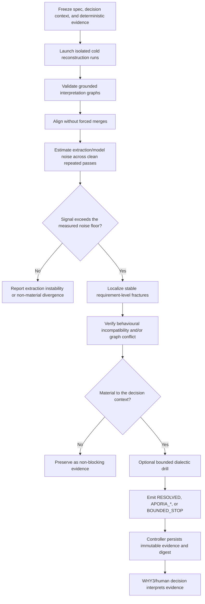

# Decision-relative Socratic Understanding specification

**Status:** authoritative handoff baseline
**Scope:** architecture and evidence contract; not implementation authorization
**Repository reality:** SUE v1–v3, dialectic, justification graph, and automatic
orchestration already exist. Status annotations below distinguish implemented,
experimental, and proposed elements.

## 1. Purpose

The subsystem evaluates whether independently reconstructed interpretations of
a software specification are compatible for a stated decision.

It answers:

> If multiple cold readers reconstruct what this specification requires, do
> their grounded interpretations imply materially compatible behaviour for the
> decision we are about to make?

It does not answer:

- whether a majority interpretation is true;
- what the author privately intended;
- whether the implementation is correct;
- whether every ambiguity matters to every decision; or
- how to rewrite the specification.

## 2. Normative principles

1. **Decision-relative:** compatibility is evaluated against an explicit
   decision context, not as an unbounded property of prose.
2. **Agreement is not truth:** convergence is evidence of semantic
   reproducibility under the measured conditions.
3. **Cold reconstruction:** readers cannot see other runs, aggregates, the
   reasoning journal, or squad conclusions before aggregation.
4. **Grounded claims:** every scored relation, behavioural assertion, conflict,
   and assumption carries source provenance and run identity.
5. **Layer separation:** vocabulary divergence, extraction instability,
   provider/model variance, and specification ambiguity are reported
   separately.
6. **Behaviour before wording:** compatibility is decided from grounded
   behavioural consequences and typed relations, not prose similarity alone.
7. **Preserved disagreement:** aggregation records minority and unmatched
   interpretations; it never forces a merge to create consensus.
8. **Aporia is diagnostic:** an impasse can be the correct result. It does not
   automatically imply a defective requirement.
9. **Diagnose only:** the subsystem never silently rewrites the challenged
   specification.
10. **Measured promotion:** heuristic candidates cannot become blocking
    workflow evidence until the relevant experimental gate has passed.

## 3. Decision context

Every integrated run SHALL have a decision context:

```yaml
decision_context:
  id: string
  kind: implementation-readiness | architecture-choice | test-design | change-impact
  question: string
  in_scope_requirements: [string]
  material_behaviours: [string]
  severity_policy_ref: string
```

Compatibility is decision-relative:

```text
compatible(Ia, Ib, D) =
  no grounded consequence of Ia conflicts with a grounded consequence of Ib
  for any material behaviour in decision context D
```

Textual or graph divergence outside `D` remains visible but does not
automatically block the decision.

The schema is proposed and requires approval before integration. Existing
standalone scripts currently accept a spec and optional focus/target rather than
this complete context.

## 4. Inputs and outputs

### Inputs

- immutable specification snapshot and digest;
- requirement/acceptance-criterion identifiers;
- optional glossary or controlled vocabulary;
- deterministic Understanding report and digest;
- decision context;
- reader configuration: provider, model tag, framing, pass, timeout, tool/schema
  version; and
- experiment or operational policy: reader count, support threshold, cost bound,
  and stop rules.

### Outputs

- per-run interpretation graphs;
- aggregate alignment and divergence report;
- extraction/model variance diagnostics;
- stable findings and minority variants;
- exhibited behavioural incompatibilities, when verified;
- justification-graph conflicts, when the H-D2 gate permits their use;
- optional bounded dialectic traces and aporia states;
- immutable JSON evidence plus a human-readable report;
- digest and provenance suitable for controller-owned state; and
- an explicit non-blocking/blocking classification under the decision context.

## 5. Components and responsibilities

| Component | Responsibility | Current implementation |
|---|---|---|
| Deterministic baseline | Parse requirements, compute stable quality metrics, entity/behaviour diagnostics, and quality gates. | `src/understanding/service.py::analyze_spec_bundle`; controller evidence in `src/harness/understanding_gate.py::run_understanding_gate`. |
| Cold reader launcher | Start fresh provider calls with only the permitted context; record run configuration. | Process isolation in `scripts/sue_challenge.py::run_model_call`; reader matrices in `scripts/sue_reproducibility.py::build_reader_jobs`. Full OS/provider independence remains an experimental concern. |
| Challenge reader | Generate questions, then answer them from the spec alone. | `scripts/sue_challenge.py`; repeated by `scripts/sue_consensus.py::run_reader`. |
| Interpretation extractor | Produce typed, requirement-local relations, assumptions, and behavioural assertions. | `scripts/sue_reproducibility.py::build_extraction_prompt` and `validate_graph`. |
| Aligner/scorer | Align grounded records, score agreement per requirement, estimate cross-pass noise, and preserve unmatched records. | `score_requirements`, `aggregate_passes`; glossary-canonical alignment is planned. |
| Consensus aggregator | Cluster independently reproduced findings and separate stable support from sampling noise. | `scripts/sue_consensus.py::cluster_findings` and `split_stable`. |
| Behavioural witness verifier | Exhibit a concrete situation in which two grounded consequences cannot both hold. | Candidate generation exists in `find_witnesses`; verification is not implemented. |
| Justification graph | Record claims, evidence, assumptions, and conflicts; measure conflict convergence. | `scripts/sue_jgraph.py`; still an instrumented pilot pending blind H-D2 adjudication. |
| Dialectic drill | Apply deterministic cognitive operators to one selected fracture and terminate in resolution, aporia, or bounded stop. | `scripts/sue_dialectic.py::run_dialogue`; manual/Forensic evidence. |
| Profile orchestrator | Select tiers, seeds, lenses, and consolidate a diagnose-only dossier. | `scripts/sue_auto.py::main`. |
| Workflow evidence adapter | Persist immutable SUE evidence, update controller-owned state, and inject evidence into WHY3. | Proposed; not present in `extension/workflow/definition.yaml` or `phase3-consensus.md`. |

## 6. Cognitive operators, not personas

Cold readers are interchangeable executions with controlled framing, not
philosopher characters. The normative operator vocabulary is:

- `DEFINE`
- `DISTINGUISH`
- `CAUSE_OR_CRITERION`
- `COUNTEREXAMPLE`
- `FOLLOW_CONSEQUENCE`
- `TEST_OPPOSITE`
- `DIVIDE`
- `REVISE`

Existing Platonic lens names select deterministic transition policies in
`scripts/sue_dialectic.py::LENSES`. They SHALL remain labels for policies, not
identities that invite role-play or shared priors during cold reconstruction.

## 7. Interpretation graph

The implemented v3 graph is requirement-local:

```yaml
interpretation_run:
  run_id: string
  provider: string
  model_tag: string
  framing: structural | behavioural | adversarial
  pass: integer
  spec_digest: sha256
  requirements:
    FR-001:
      edges:
        - source: string
          type: performs | acts_on | applies_when | results_in |
                except_when | assumes | requires | transitions_to
          target: string
          source_line: integer
          confidence: number
      assumptions:
        - text: string
          source_line: integer
      assertions:
        - given: string
          when: string
          then: string
          source_lines: [integer]
```

Integrated evidence SHOULD add explicit `spec_digest`, `run_id`, tool/schema
version, and decision-context identity to the current standalone sidecar.

Alignment order:

1. exact requirement/controlled-vocabulary identifier;
2. deterministic normalization;
3. declared glossary aliases/canonical terms;
4. type-constrained structural similarity;
5. explicitly unmatched.

No stage may force-merge ambiguous candidates. Embedding alignment is excluded
from the smallest prototype because it adds a second stochastic/opaque layer
before deterministic alignment has passed A1.

## 8. Justification graph

The justification graph records:

```yaml
claim:
  id: string
  text: string
  inference: stated | derived
  evidence_lines: [integer]
  assumptions: [string]
  conflicts_with: [claim_id]
```

Cross-reader conflict convergence is useful only when both claim sides remain
evidence-anchored. Until the blind H-D2 experiment passes, the graph is an
instrumented pilot and cannot independently create a blocking workflow verdict.

## 9. Processing cycle



Cold reconstruction ends before aggregation. Dialectic work begins only after a
fracture is selected, so later reasoning cannot contaminate the independent
sample.

## 10. Failure taxonomy

| State | Meaning | Blocking rule |
|---|---|---|
| `VOCABULARY_DIVERGENCE` | Equivalent structure under different labels. | Non-blocking; improve glossary/alignment. |
| `EXTRACTION_INSTABILITY` | Repeated clean runs disagree above the accepted floor. | Non-blocking; invalidates the measurement gate. |
| `PROVIDER_VARIANCE` | Divergence concentrates by provider/model family. | Non-blocking until independently localized to spec evidence. |
| `SPEC_AMBIGUITY_CANDIDATE` | Stable different readings share a requirement anchor. | Non-blocking heuristic. |
| `GROUNDED_CONTRADICTION` | Independently reproduced, evidence-anchored incompatible claims. | May block if material to the decision context. |
| `BEHAVIOURAL_INCOMPATIBILITY` | A concrete situation exhibits outcomes that cannot both be satisfied. | May block if stable, grounded, and decision-material. |
| `APORIA_UNDEFINED` | The text supplies no stable definition or criterion. | Diagnostic; severity depends on decision materiality. |
| `APORIA_CONTRADICTED` | The text supports incompatible answers and cannot repair them. | Candidate blocker with provenance and materiality review. |
| `APORIA_UNDERDETERMINED` | Multiple valid readings remain. | Candidate blocker only when readings change material behaviour. |
| `BOUNDED_STOP` | The drill exhausted its turn budget. | Never a verdict. |

## 11. Evidence and state ownership

- SUE reports SHALL be immutable and digest-addressed in integrated runs.
- The workflow controller, not a qualitative agent, SHALL write SUE evidence
  state.
- SAGE MAY interpret SUE evidence but SHALL NOT launch readers, recalculate
  scores, rewrite the report, or overwrite state.
- The reasoning journal SHALL receive a registered entry referencing the report
  digest and summarized decision consequence, not raw hidden reasoning.
- Report schemas SHALL be versioned.
- A changed specification digest invalidates prior SUE evidence.

## 12. Integration contract

The proposed node sequence is:

```text
phase3-plan
  → phase3-understanding
  → phase3-socratic-understanding
  → phase3-consensus
  → phase3-consensus-tasks-lexicon
```

`phase3-socratic-understanding` is controller-owned and provider-dependent.
It consumes the immutable outputs of `phase3-understanding`, but its evidence is
kept in a distinct channel because deterministic metrics and sampled semantic
reconstruction have different uncertainty.

Minimum proposed state:

```yaml
sue_evidence:
  status: completed | error | inconclusive
  path: string
  digest: sha256
  spec_digest: sha256
  schema_version: integer
  decision_context_id: string
  measurement_gate: pass | fail | inconclusive
  blocking_findings: [string]
  diagnostic_findings: [string]
```

This contract is pending user approval and successful experimental gates.

## 13. Falsifiable gates

### A1 — extraction stability

On clean specs, mean typed-edge agreement must be `≥0.80` and minimum agreement
per spec `≥0.70`. Failure means fix extraction or halt absolute-SR claims.

### A2 — mutation detection

At least four of five approved mutation operators must fire on their
pre-registered primary channel after A1 passes.

### A3 — localization

Precision@3 must be `≥0.60` and recall `≥0.70` for detected mutants.

### A4 — clean false positives

At most 10% of clean specs may be falsely flagged at the chosen threshold.

### A5 — incremental value

Semantic features must improve mutant classification AUC by `≥0.05` over the
deterministic Understanding baseline and demonstrate useful relation to
historical rework.

### A6 — operational cost

Record tokens, calls, and wall clock. The v0 target is at most 15 minutes per
variant at K=5; cost is a design input, not a truth criterion.

No workflow gate may be promoted before its prerequisite experimental gate is
met. A failed gate is a valid result and SHALL be recorded without rhetorical
promotion.

## 14. Test and acceptance strategy

The implementation plan SHALL cover:

- strict schema and provenance validation;
- no forced merge;
- spec digest invalidation;
- cold-reader context exclusion;
- stable/noise separation across repeated passes;
- vocabulary vs semantic divergence separation;
- verified-witness citation of both sides;
- aporia and bounded-stop semantics;
- provider/framing confound checks;
- partial-reader degradation;
- report-path collision and no spec writes;
- controller/agent state ownership;
- stale/corrupt evidence rejection;
- workflow routing for blocking vs diagnostic evidence; and
- cost/call stop conditions.

## 15. Non-goals for the next approved phase

- automatic requirement rewriting;
- claiming authorial intent or ground truth;
- full recursive SUE;
- embedding-based graph alignment;
- new philosopher-persona agents;
- replacing deterministic Understanding;
- replacing human judgment for high-impact ambiguity; or
- running the full 10–15 spec corpus before A1 and the bounded smoke pass.
