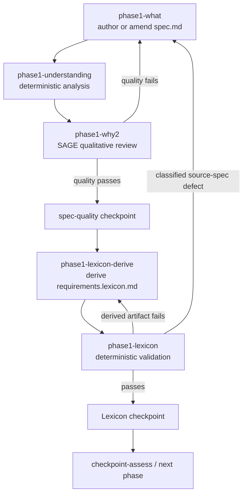

# Phase 1 Quality Before Lexicon Design

## Status

Approved on 2026-07-25.

This design corrects the dependency order established by the earlier visible
Lexicon and controller-owned Understanding work. The rich `spec.md` is the
canonical source. `requirements.lexicon.md` is a derived representation and
must be produced only from a quality-certified version of that source.

## Goal

Separate Phase 1 into two bounded loops:

1. author or amend the canonical specification until deterministic
   Understanding and qualitative SAGE review certify its quality;
2. derive and validate the Lexicon representation until the deterministic
   Lexicon gate certifies it.

No broad specification-authoring role may be used as the ordinary Lexicon
repair worker.

## Workflow



The normal route is:

```text
phase1-what
  -> phase1-understanding
  -> phase1-why2
  -> phase1-lexicon-derive
  -> phase1-lexicon
  -> checkpoint-assess
```

The spec-quality loop is:

```text
phase1-what -> phase1-understanding -> phase1-why2 -> phase1-what
```

The derived-artifact loop is:

```text
phase1-lexicon-derive -> phase1-lexicon -> phase1-lexicon-derive
```

## Ownership

### `phase1-what`

Owns only canonical requirements authoring:

- `spec.md`;
- `00-overview.md`;
- amendments to those artifacts after evidence or SAGE findings;
- the existing authoring result fields and evidence-routing requests.

It does not create or repair `requirements.lexicon.md` and does not receive
ordinary Lexicon validation findings.

### `phase1-understanding`

Runs deterministic analysis against the current `spec.md`, persists immutable
evidence, and binds that evidence to the current spec digest. It does not
dispatch a provider.

### `phase1-why2`

Reads the controller-certified Understanding evidence and performs qualitative
review. A failure returns to `phase1-what`. A pass creates controller-owned
spec-quality certification for the exact current `spec.md` digest and advances
to Lexicon derivation.

### `phase1-lexicon-derive`

Is a narrow artifact-producing node. It:

- reads the quality-certified `spec.md`, configured glossary, and, on retry,
  `spec-lexicon-report.json`;
- writes only `requirements.lexicon.md`;
- preserves every source requirement and acceptance-criterion identifier;
- emits no validation verdict or controller-owned state;
- cannot declare specification completion, downstream readiness, or a quality
  waiver.

On retry it repairs or regenerates the complete derived artifact from the
canonical source. Regeneration is preferred over incremental prose amendment so
stale source content cannot survive.

### `phase1-lexicon`

Remains provider-free and deterministic. It validates the exact configured
source and derived artifact, writes the structured report, owns attempt
accounting, and certifies a passing artifact.

## Content-Bound Certifications

Routing must never rely on an unqualified historical Boolean.

The spec-quality certification records:

```yaml
spec_quality_certificate:
  schema_version: 1
  source_path: <project-relative spec.md path>
  source_sha256: <64 lowercase hexadecimal characters>
  understanding_evidence: <immutable report path>
  understanding_evidence_sha256: <64 lowercase hexadecimal characters>
  sage_phase: phase1-why2
  status: passed
```

The Lexicon certification records:

```yaml
lexicon_certificate:
  schema_version: 1
  source_path: <project-relative spec.md path>
  source_sha256: <same digest as the current spec-quality certificate>
  artifact_path: <project-relative requirements.lexicon.md path>
  artifact_sha256: <64 lowercase hexadecimal characters>
  report_path: <spec-lexicon-report.json path>
  report_sha256: <64 lowercase hexadecimal characters>
  status: passed
```

The controller validates the referenced files and digests before accepting
either certificate as routing evidence.

## Amendment And Invalidation Rules

Any successful write to `spec.md`, whether initial authoring, evidence-driven
amendment, issue resolution, rewind, or later qualitative repair:

1. invalidates the prior spec-quality certificate;
2. invalidates the prior Lexicon certificate;
3. marks the derived Lexicon artifact stale for routing purposes;
4. routes through deterministic Understanding and SAGE again;
5. permits Lexicon derivation only after the new spec digest is
   quality-certified.

A write confined to `requirements.lexicon.md` invalidates only the Lexicon
certificate. It never invalidates spec quality.

The controller performs invalidation by comparing current file digests to the
certificate digests at the phase boundary. Correctness does not depend on the
agent remembering to clear state.

## Source-Spec Defects

Ordinary Lexicon findings are derived-artifact defects:

- parse or grammar errors;
- stale source hash;
- missing or extra derived IDs;
- glossary violations;
- malformed blocks or expressions.

They route only to `phase1-lexicon-derive`.

If derivation cannot proceed because the canonical specification itself is
contradictory or lacks an identifier needed by the source contract, the derive
node returns a narrowly structured failure. The controller classifies it as
`lexicon_source_spec_defect` and routes to `phase1-what`. That route invalidates
both certificates and restarts the complete spec-quality loop. A Lexicon agent
cannot classify its own grammar difficulty as a source defect merely to escape
its repair budget; the controller accepts only declared source-defect result
fields and requires concrete source locations.

## Attempts, Exhaustion, And Recovery

Spec-quality and Lexicon attempts are independent:

- Understanding/SAGE repair cycles use the existing Phase 1 convergence budget.
- Lexicon validation failures use `lexicon_gate.max_repair_attempts`.
- A missing derived artifact is `pending` and routes to
  `phase1-lexicon-derive` without fabricating a failed verdict.
- A Lexicon validation failure routes to `phase1-lexicon-derive` while budget
  remains.
- An unchanged derived artifact after a repair dispatch blocks immediately as
  `lexicon_repair_no_artifact_progress`.
- Exhaustion under the configured hard policy blocks at `phase1-lexicon`.
- Recovery reopens a bounded Lexicon derivation attempt; it never invokes
  `phase1-what` unless a source-spec defect was classified.

Manual recovery commands must point to the narrow node:

```text
echelon phase run phase1-lexicon-derive
```

After a successful manual derivation replay, the next action is:

```text
echelon phase run phase1-lexicon
```

## Checkpoints

The controller persists:

- the existing authoring checkpoint after `phase1-what`;
- a controller checkpoint after `phase1-why2` certifies the current spec
  digest;
- an artifact checkpoint after `phase1-lexicon-derive`;
- a controller checkpoint after `phase1-lexicon` certifies the current source
  and derived digests.

The final Phase 1 human/automatic checkpoint remains after Lexicon
certification. A resumed run can therefore determine whether it must restart
spec quality, rerun only derivation, rerun only deterministic validation, or
continue.

## Compatibility

Active runs are normalized conservatively:

- a historical Lexicon pass is accepted only when its existing evidence proves
  the current source and artifact digests;
- a historical Understanding report may seed spec-quality certification only
  when it is controller-owned, content-bound to the current source, and
  followed by a passing WHY2 result for the same artifact epoch;
- otherwise the run restarts at `phase1-understanding`, preserving authored
  files;
- exhausted historical Lexicon runs recover at
  `phase1-lexicon-derive`, not `phase1-what`;
- no compatibility switch or dual workflow is introduced.

## Testing

Graph tests prove:

- WHAT routes to Understanding, not Lexicon;
- WHY2 pass routes to Lexicon derivation;
- WHY2 failure routes to WHAT;
- derivation routes only to deterministic Lexicon validation;
- Lexicon failure or pending state routes only to derivation;
- Lexicon pass routes to the Phase 1 checkpoint.

Executor and controller tests prove:

- the derivation prompt contains only certified source and Lexicon repair
  context;
- the derivation node can write only the configured derived artifact;
- unchanged-artifact detection applies to derivation;
- an exhausted gate cannot be manually recovered through WHAT;
- spec changes invalidate both certificates by digest;
- derived-artifact changes invalidate only the Lexicon certificate;
- stale certificates cannot route forward;
- checkpoints are recorded after quality certification, derivation, and
  Lexicon certification;
- provider-free nodes do not dispatch an LLM.

Integration tests cover initial authoring, quality repair, Lexicon repair,
post-amendment recertification, manual recovery, and active-run normalization.

## Design Self-Review

- `spec.md` is the only semantic source of truth.
- Spec-quality and derived-artifact loops have separate ownership and budgets.
- Every forward certificate is bound to current file content.
- A source amendment always repeats quality validation before Lexicon work.
- The narrow Lexicon node cannot declare broad workflow readiness.
- No compatibility switch, warning bypass, or unrelated Phase 3 change is in
  scope.
