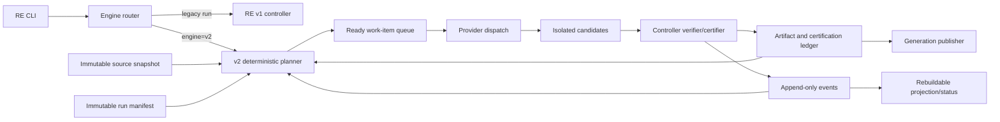

# RE v2 Pinned Execution Kernel Design

## Status

Implemented as the opt-in EGR-164 deterministic L0 kernel on 2026-08-17. The
implementation range is `9248509f6707804a852bbff8a934c8891e2147f2` through
`cd26f6fcf9eb84bef0d4b791a4f0ef5ceca07eab`. This document also defines the
stable boundaries required by EGR-165 through EGR-170; it does not claim those
later behaviors. Existing RE v1 runs and artifacts remain supported under their
existing contract and v1 remains the default.

Production v2 currently registers only deterministic L0 source and partition
inventory. Layered reuse, checkpoint adoption, semantic audit, synthesis,
selective deepening, L1-L4 producers, and atomic element repair remain later
EGR work. The generic exact-root publication primitive is implemented, but no
v2 synthesis producer or operator synthesis workflow is registered.

### EGR-164 implementation evidence

- The exact plan matrix passed 485 tests in a clean process with
  `COLUMNS=200`; the expanded matrix, including dry-run mutation coverage,
  passed 495 tests. Task 11's final CLI/status slice passed 118 tests and its
  broader RE/CLI matrix passed 460.
- The strengthened Task 12 fault/isolation slice passed 35 tests. It covers
  snapshot creation, dispatch start, provider termination, candidate rename,
  certification, checkpoint, generation promotion, and index replacement.
- The truthful dispatch counts are one after `snapshot_created`, two after
  `dispatch_started` or `provider_terminated`, and one after
  `candidate_renamed` and every later seam. The durable-candidate cases recover
  without redispatch, and fresh replay reproduces `projection.json` byte for
  byte.
- V1 creation, blocked continuation, partial publication, and status execute
  through the real Typer and lifecycle boundaries while guards prove that no v2
  construction path is reached. Malformed or unsupported v2 pins fail before
  execution and preserve the filesystem.
- `bash scripts/bash/dry-run.sh` imported all 15 RE v2 modules and passed all 9
  bundle-validation checks, including the complete RE command surface and
  exact `--engine`/`--shadow` routing.

The pilot and recovery commands are documented in
`docs/runbooks/re-v2-kernel-pilot.md`. Default cutover and full-quality RE still
depend on EGR-165 through EGR-170 and the quantitative gates below.

## Context

The retained OptaSearch RE campaign exposed a structural problem rather than a
single bad retry limit. One logical run crossed provider, result-contract,
partition, continuation, validation, and publication changes while controller
state and generated artifacts remained coupled. Useful work survived in files,
but the system could not reliably identify, certify, adopt, or compose it. The
result was repeated generation, 340 semantic-validator dispatches, 34 workspace
syntheses, and more than 1.29 billion known tokens in the primary run.

The v2 kernel makes the facts needed to resume and reuse work immutable and
explicit. It separates execution history, derived status, candidate output,
certification, and publication so a crash, budget change, new binary, or later
deepening request does not silently redefine completed work.

Detailed campaign evidence and the ordered follow-up program are in
`docs/findings/2026-08-14-re-cost-and-layering-findings.md`.

## Goals

- Pin every v2 run to one immutable source snapshot and protocol contract.
- Make accepted work content-addressed and independent of mutable controller
  state.
- Recover deterministically after interruption without repeating certified
  provider work.
- Separate global resource ceilings from semantic attempt and convergence
  policy.
- Provide stable extension points for layered artifacts, adoptable checkpoints,
  audit epochs, deferred synthesis, and selective deepening.
- Keep v1 behavior unchanged while v2 is tested, shadowed, and piloted.
- Make all scheduling, reuse, rejection, and terminal decisions explainable to
  an operator.

## Non-goals

- Migrating an active v1 run into v2.
- Changing v1 state, retry, artifact, or publication semantics.
- Implementing layered artifact reuse (EGR-165) or cross-run checkpoint
  adoption (EGR-166) in EGR-164.
- Implementing frozen semantic audit epochs (EGR-167), deferred synthesis
  (EGR-168), or selective deepening (EGR-169) in EGR-164.
- Implementing atomic element repair (EGR-170).
- Parallel provider dispatch in the first live v2 release.
- Cross-machine transport of unpublished caches and candidates.
- Automatically selecting exhaustive depth.

## Design Principles

1. **Immutable inputs, append-only decisions.** A run's source, protocol, and
   requested goals do not change. New work produces new events and artifacts.
2. **Artifacts are facts; status is a projection.** Accepted bytes and their
   certification receipts are authoritative. Human-readable status can always
   be rebuilt.
3. **The controller certifies.** Provider output is an untrusted candidate even
   if it contains a syntactically valid result object.
4. **Identity follows semantic inputs.** Operational ceilings do not invalidate
   artifacts unless they change artifact policy.
5. **Completion is goal-relative.** A compact baseline can be complete for its
   selected goals without claiming exhaustive understanding.
6. **No in-place protocol migration.** A run either executes its pinned engine
   and protocol exactly or refuses to continue.

## Architecture

The CLI routes each run to the engine recorded at creation. New v2 runs use a
pinned source snapshot, a deterministic planner, an append-only event store, a
candidate area, and a content-addressed artifact and certification ledger.
`projection.json` is a rebuildable convenience view, never an authority.



### Component boundaries

- **Engine router:** reads the immutable run manifest and invokes exactly v1 or
  v2. It never guesses from directory shape and never upgrades a run.
- **Snapshot manager:** freezes source inputs and returns a content-addressed
  `source_snapshot_id` plus a read-only execution path.
- **Run store:** creates and validates the immutable run manifest, appends
  hash-chained events, and rebuilds projections.
- **Planner:** derives immutable work items from the run manifest, artifact DAG,
  selected goals, certifications, and budget state.
- **Dispatcher:** leases one ready work item, invokes the configured provider,
  and persists observable dispatch accounting.
- **Candidate store:** durably records provider output before it is interpreted
  or promoted.
- **Certifier:** verifies candidate scope, structure, evidence, and
  workflow-specific acceptance rules; only it can issue a receipt.
- **Ledger:** indexes immutable artifact objects and certification receipts.
- **Publisher:** atomically exposes a generation assembled from an exact set of
  accepted artifact roots.
- **Projection/status renderer:** explains current and terminal state from
  authoritative manifests, events, and ledger entries.

Each component has an explicit data contract and can be tested without running
an LLM.

## Immutable Run Contract

`runs/<run-id>/v2/run.json` is written once at run creation. Its canonical JSON
hash is the `run_manifest_id`. It contains:

```json
{
  "schema_version": 1,
  "engine": "re-v2",
  "engine_protocol_version": "2.0",
  "run_id": "re-...",
  "created_at": "...",
  "source_snapshot_id": "sha256:...",
  "source_snapshot_kind": "git-worktree|content-snapshot",
  "partition_manifest_id": "sha256:...",
  "requested_goals": [],
  "initial_budget_policy": {},
  "provider_contract": {},
  "artifact_policy_versions": {},
  "parent_run_id": null
}
```

Continuation may append budget-authorization or operator-control events but may
not rewrite this manifest. A request that changes the source snapshot,
partition manifest, goals, engine protocol, or artifact policy creates a new
run or a later explicit deepening run. The binary must either support the exact
pinned engine/protocol combination or refuse with an actionable error.

### Source freezing

- A clean Git source is frozen as a detached, read-only worktree at its resolved
  commit. Submodule identities, when present, are part of the snapshot
  manifest.
- A dirty or non-Git source is captured into a content-addressed snapshot.
  Implementations may use reflinks or safe hard links where immutability can be
  guaranteed and copies otherwise.
- The snapshot manifest records canonical relative paths, file content hashes,
  modes relevant to analysis, exclusions, and capture implementation version.
- Providers read only the snapshot path. They never read the mutable checkout
  from which the run was launched.

## Artifact and Certification Model

EGR-164 establishes the identity and ledger interfaces. EGR-165 will populate
the full layer policies.

An artifact has a canonical `ArtifactKey`:

```text
ArtifactKey = {
  source_snapshot_id,
  partition_manifest_id,
  artifact_kind,
  layer,
  producer_protocol_version,
  layer_policy_hash,
  dependency_hashes
}
```

The artifact object is addressed by the hash of its canonical bytes. The key
and object hash are recorded in an immutable ledger receipt. A global execution
profile is deliberately absent. Raising a token or time ceiling therefore does
not make accepted bytes stale. A policy value appears in `layer_policy_hash`
only when changing it can materially change the artifact's required content.

Certification is separate from artifact identity:

```text
CertificationKey = {
  artifact_hash,
  verifier_id,
  verifier_version,
  source_snapshot_id,
  audit_epoch_id | null
}
```

A certification receipt records verdict, normalized diagnostics, evidence
references, scope verification, timestamp, and the event that accepted or
rejected the candidate. Provider-authored verdicts are evidence only; they
cannot create receipts.

### Layer contract reserved for follow-on EGRs

- **L0 deterministic inventory:** files, symbols, topology, evidence index, and
  partition inputs.
- **L1 compact baseline:** bounded overview and core behavioral specification.
- **L2 goal-specific depth:** selected contracts, flows, integrations, and edge
  behavior.
- **L3 semantic audit overlay:** frozen findings, closure receipts, and accepted
  debt.
- **L4 exhaustive depth:** explicitly requested critical domains.

Higher layers reference lower-layer hashes and never replace them. A partition
protocol change branches the affected downstream DAG; it does not invalidate
source inventory whose identity and dependencies remain unchanged.

## Planning, Scheduling, and Budgets

The planner computes a work DAG from the immutable run manifest and currently
certified artifacts. Each work item contains:

- a stable ID derived from its semantic inputs;
- required input artifact hashes;
- expected output artifact key;
- provider and result-contract requirements;
- verifier identity and version;
- applicable attempt and resource budgets.

Only dependency-complete, uncertified items enter the ready queue. The first
release dispatches one item at a time. The ready-queue contract permits later
bounded parallelism without changing identities or result semantics.

Budget dimensions are independent:

- global token ceiling;
- global elapsed/provider-active time ceilings;
- provider invocation attempts;
- artifact-generation attempts;
- semantic audit repair rounds;
- result-contract retries.

An operator may append authorization that raises a global resource ceiling.
That does not increase semantic rounds, generation attempts, or contract retry
limits. V2 has no equivalent of the v1 `--re-max-inner` coupling. A budget
event records who changed which dimension, its old and new values, and why.

## Event and State Model

`events.jsonl` is the authoritative execution history. Every canonical event
contains monotonically increasing `seq`, `previous_event_hash`, event schema
version, timestamp, type, and payload. Representative event types are:

- `run_created`;
- `work_planned`;
- `dispatch_leased`, `dispatch_started`, and `dispatch_observed`;
- `candidate_persisted`;
- `candidate_certified` or `candidate_rejected`;
- `artifact_accepted`;
- `budget_authorized` and `operator_pause_requested`;
- `checkpoint_recorded`;
- `synthesis_requested` and `synthesis_accepted`;
- `run_paused` and `run_resumed`;
- `run_completed`, `run_finalized_partial`, or `run_failed`.

Event payloads reference content hashes rather than embedding mutable artifact
state. Unknown event schema versions, a broken hash chain, duplicate sequence
numbers, or conflicting terminal events fail closed. `paused` is explicitly
continuable: a later authorization or operator action can append `run_resumed`.
`complete`, `finalized_partial`, and `failed` are terminal and cannot resume in
place. Further goals or changed policy require a new run referencing the
accepted artifacts.

`projection.json` is generated by a pure replay function. Deleting and
rebuilding it from the same manifest, events, and ledger must produce
byte-identical canonical JSON. Controller code must not read projection fields
as a substitute for an authoritative event or receipt.

## Candidate Durability and Recovery

A dispatch creates a process lease before provider invocation. Provider output
is streamed or copied to a unique temporary candidate directory, flushed, and
atomically renamed before `candidate_persisted` is appended. Artifact objects,
ledger receipts, checkpoints, and the workspace index use the same
write-flush-rename discipline; directory metadata is flushed where the
platform permits it.

On recovery the controller:

1. validates the run manifest, event chain, ledger, and object hashes;
2. proves that any process associated with an outstanding lease has stopped or
   is safely reattached;
3. discovers durably persisted candidates not yet certified;
4. certifies or rejects those candidates before planning replacement work;
5. rebuilds the projection and ready queue from authoritative data.

A valid persisted candidate may therefore succeed after provider timeout,
output-length termination, missing result object, controller crash, or process
restart. Those transport/protocol symptoms do not erase the artifact. Hash
mismatch, ambiguous ownership, concurrent conflicting writers, or an
unverifiable mutation fails closed and requires an explicit operator action or
new work item.

## Persistence and Publication Layout

```text
runs/<run-id>/v2/
  run.json                 immutable run manifest
  events.jsonl             authoritative append-only event log
  projection.json          rebuildable status view
  ledger.jsonl             artifact/certification receipts
  candidates/              isolated durable provider outputs

<workspace>/re/v2/
  index.json               atomic pointer to published generations
  generations/<id>/        tracked semantic artifact roots/manifests

<workspace>/re/.cache/v2/
  objects/                 deterministic or unpublished content objects
  extracted/               reproducible L0 extraction cache
  checkpoints/             unpublished certified checkpoints
```

Published semantic artifacts and their manifests are cloneable and tracked.
Large deterministic L0 objects and unpublished candidates/checkpoints may stay
in a local ignored cache because they are reproducible or not yet published.
Publication writes a complete immutable generation first and changes
`re/v2/index.json` last with compare-and-swap against the expected prior index.

Synthesis is keyed by the exact accepted source-root hash set and synthesis
policy. At most one accepted synthesis exists for a unique input set and
policy. Later deepening creates a new input set and synthesis node; it does not
erase an earlier valid generation. EGR-168 will define when a source outcome is
accepted as complete or explicit partial and therefore eligible for synthesis.

## V1 Compatibility and Adoption

The router preserves a hard boundary:

- a v1 run always invokes the existing v1 controller;
- v1 state and artifacts are never interpreted as v2 authority;
- a v2 run never rewrites v1 state;
- active v1 runs are not migrated;
- temporary explicit creation of v1 runs remains available during rollout.

EGR-166 may allow v2 to adopt useful v1 output through a read-only import path.
Adoption must independently match source snapshot and domain identity, copy the
artifact as a candidate, run the pinned v2 verifier, and issue a v2 receipt.
V1 counters, audit status, synthesis state, and publication flags are never
imported. A mismatched or unverifiable artifact is rejected without modifying
the v1 source.

## Semantic Convergence Boundary

EGR-167 owns the detailed audit algorithm, but the kernel reserves its required
invariants:

- an audit epoch is an immutable object with a stable ID;
- its normalized finding set is persisted once;
- repairs address only that set and closure checks only that set;
- newly discovered concerns require an explicit later epoch rather than
  extending the current loop;
- two consecutive rounds with no reduction in open findings transition the
  remainder to explicit debt;
- exhaustion of the semantic budget produces debt or a policy-defined blocked
  outcome, never an implicit increase in attempts.

Stable finding identity derives from rule, source anchor, and evidence identity,
not mutable prose wording.

## Goal-relative Completion and Selective Deepening

The run manifest records explicit goals and their required artifact/layer
outputs. A goal is complete only when all required outputs have acceptable
certifications or a policy-authorized partial/debt outcome. Run completion does
not imply every possible layer is exhaustive.

EGR-169 will expose a command such as:

```text
echelon re deepen --source <source> --domain <domain> --goal <goal>
```

It creates new work over matching certified lower layers. An unchanged snapshot
and unrelated domains must require zero provider dispatches. The exact command
surface remains an EGR-169 decision; the identity and planning contracts in
this design make it possible.

## Operator Experience and Observability

The implemented `echelon re status` and `echelon re status --json` views show:

- engine and protocol version;
- source snapshot and partition manifest identities;
- requested goals and exact L0 accepted/required artifact counts;
- current or next work item;
- known tokens, unknown-token dispatches, and coverage completeness;
- token and active-time used, remaining, and authorized values;
- provider, generation, semantic-round, and result-contract attempt usage by
  work item against the authorized per-item limit;
- artifacts reused, adopted, generated, certified, and rejected;
- plan counts, publication generation when present, lifecycle reason, and next
  action; and
- literal `not registered` values for audit and synthesis in the EGR-164 pilot.

The human heading is the final-state banner and is derived from the same replay
as JSON. Shadow mode additionally explains, without dispatching, why each L0
template would be reused, generated, rejected, or blocked. Source/domain layer
breakdown, audit epochs and debt, and synthesis input roots are follow-on
status-schema work owned by EGR-165 through EGR-169.

## Failure Handling

- **Unsupported engine/protocol:** refuse continuation and identify a compatible
  Echelon version; never auto-upgrade.
- **Source snapshot missing:** restore or recapture only if its manifest and all
  hashes match; otherwise fail closed.
- **Event or ledger corruption:** stop before dispatch or publication and name
  the first invalid record.
- **Provider timeout/length/missing result:** persist available candidate bytes,
  then let controller certification decide; consume only the applicable
  contract or provider-attempt budget.
- **Verifier rejection:** record normalized diagnostics and schedule a bounded
  replacement only if its generation budget remains.
- **Global token/time exhaustion:** append `run_paused` with the exact exhausted
  dimension. Explicit authorization may raise that dimension and resume the
  same pinned run.
- **Attempt or semantic-round exhaustion:** apply the goal's approved debt or
  partial policy; otherwise pause for an explicit operator choice. Increasing a
  global token/time ceiling cannot change these limits.
- **Publication race:** compare-and-swap fails without replacing the current
  index; re-plan against the new index.

## Testing Strategy

### Deterministic kernel and property tests

- Artifact, work-item, finding, snapshot, and certification IDs are stable
  under canonical serialization and change only when their defined inputs
  change.
- DAG construction rejects missing dependencies and cycles.
- Event replay always produces the same byte-identical projection.
- Budget dimensions are independent and never underflow or cross-increment.
- Goal completion follows required outputs and explicit partial/debt policies.
- Audit epochs are immutable after creation.
- Changing one layer/domain invalidates only its dependent subgraph.
- Imported v1 artifacts cannot become accepted without v2 certification.

EGR-164 implements and tests the canonical identity, DAG, event replay, budget,
L0 goal-completion, and v1-isolation subset. Finding epochs, selective
invalidation, and v1 artifact adoption remain acceptance tests for their owning
follow-on EGRs.

### Fault-injection tests

The implemented EGR-164 matrix crashes the controller immediately after each
of:

- snapshot creation;
- dispatch start;
- provider termination;
- candidate rename;
- certification receipt write;
- checkpoint recording;
- generation promotion;
- workspace-index replacement.

Recovery must neither lose certified work nor duplicate a completed dispatch.
It must certify a durable orphan candidate before generating a replacement.
EGR-168 adds the synthesis-object boundary when it registers synthesis.

### Compatibility tests

- Existing v1 fixtures and lifecycle tests remain unchanged.
- V1 runs never invoke v2 modules.
- V2 rejects engine/protocol mismatches.
- No v1 state field is authoritative in a v2 projection or publication.

EGR-166 owns the additional proof that a v1 artifact can enter only through
candidate import and independent v2 recertification; no such import path is
registered by EGR-164.

## Quantitative Acceptance Gates

EGR-164 and its follow-on pilots are accepted only when the following are
demonstrated by automated fixtures or retained-run replay:

- An unchanged snapshot with already certified matching goals causes zero
  provider dispatches after adoption is enabled.
- Deepening one selected domain causes zero unrelated-domain dispatches.
- One semantic audit discovery creates one immutable epoch plus no more than its
  configured closure rounds; it cannot extend itself with new findings.
- Two consecutive no-reduction repair rounds terminate in explicit debt.
- One accepted source-root set and synthesis policy causes at most one synthesis
  dispatch.
- Raising the global token ceiling does not change any semantic or generation
  attempt limit.
- Token summaries distinguish known usage from unknown dispatches and never
  present incomplete totals as exact.
- Replaying a fixture regenerates a byte-identical projection.
- Shadow planning explains every reuse, adoption, generation, rejection, and
  blocked decision.
- Selected live pilots use fewer tokens than matched v1 goals without reducing
  certified quality outcomes.

EGR-164 proves the resource-limit isolation, truthful token summary,
byte-identical projection replay, and L0 shadow-explanation gates. Checkpoint
adoption, selective deepening, bounded audit/debt, idempotent synthesis, and
matched live-pilot efficiency depend on EGR-166, EGR-169, EGR-167, EGR-168,
and the later pilots respectively. EGR-164 supplies their deterministic
fixtures and interfaces; default cutover waits until the full set passes.

## Rollout

1. **Complete:** build and test the v2 kernel with deterministic providers and
   replay fixtures.
2. **Complete:** expose explicit `--engine v2` creation while continuing
   existing runs from their recorded engine.
3. **Partially complete:** shadow planning is implemented and covered by a
   zero-dispatch fixture. Comparative shadow runs against retained v1 outcomes
   remain pilot work.
4. Run selected live pilots with fixed goals and compare certified outcome,
   dispatch count, tokens, convergence, and recovery behavior.
5. Make v2 the default only after compatibility and quantitative gates pass.
6. Keep explicit v1 creation temporarily, then remove it in a separately
   approved deprecation after active v1 demand ends.

## Implementation Boundary and Dependency Order

EGR-164's implementation plan covers only:

- engine routing and immutable run manifest;
- source snapshot creation and validation;
- canonical IDs and the initial artifact/certification ledger interfaces;
- hash-chained event append and deterministic projection replay;
- single-dispatch work leasing, durable candidates, and recovery;
- independent budget primitives;
- v2 status/final banner and shadow planning;
- v1 isolation and compatibility tests.

The follow-on order is:

1. EGR-165: populate layer-aware artifact policies and dependency graphs.
2. EGR-166: persist and adopt certified domain checkpoints.
3. EGR-167: implement immutable semantic audit epochs and plateau/debt policy.
4. EGR-168: synthesize only accepted source-root sets.
5. EGR-169: expose selective goal/domain deepening.
6. EGR-170: adapt and implement atomic specification element repair.

## Trade-offs

- **Additive v2 duplicates some machinery temporarily.** This costs code and
  test maintenance, but makes v1 continuation safe and equivalence measurable.
- **Append-only events and immutable objects use more disk.** They provide audit,
  replay, crash recovery, and reuse that mutable JSON cannot. Local deterministic
  caches remain disposable to bound repository growth.
- **Single-dispatch pilots leave throughput unused.** They simplify causality and
  recovery while the kernel is proven. The ready queue preserves a path to
  bounded parallelism later.
- **Strict protocol pinning can refuse old runs.** Explicit refusal is safer than
  silently changing semantics; compatible binaries or v1 remain the recovery
  path.
- **Goal-relative completion requires precise goal definitions.** That is
  necessary to stop equating “complete” with unbounded exhaustive analysis.

## Decisions to Revisit After Pilots

- Safe bounded parallelism and lease coordination.
- Remote transport for unpublished checkpoints and deterministic caches.
- Retention and garbage collection for unreferenced content objects.
- Whether cross-project content reuse is safe and useful.
- The duration of explicit v1 creation support.

These decisions must not change active run identities or weaken certification
and replay guarantees.
