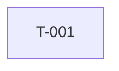

# Dependencies Template

Use this template for `dependencies.md`.

## Metadata

- Spec:
- Orchestrator:
- Mode: first-pass/consensus
- Date:

## Dependency Graph

## Parallel Execution Lanes

| Phase | Lane | Tasks | Shared State Check |
|-------|------|-------|--------------------|
|       |      |       |                    |

## External Dependencies

| Task | Dependency | Status | Risk |
|------|------------|--------|------|
|      |            |        |      |

## Circular Dependency Check

| Result | Evidence |
|--------|----------|
| PASS/FAIL | |
