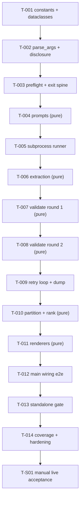

# Dependencies — SUE Challenge Script

## Metadata

- Spec: 030-build-sue-challenge-script (runs/spec-20260718-104053-744160/specs/030-build-sue-challenge-script/spec.md)
- Orchestrator: speckit-echelon-orchestrator (ORCHESTRATOR)
- Mode: first-pass
- Date: 2026-07-18

## Dependency Graph

Linear chain — every build task edits the same two files
(`scripts/sue_challenge.py`, `tests/unit/test_sue_challenge.py`), and the
constitution's Test-First gate forces tests-then-implementation inside each task.

## Parallel Execution Lanes

| Phase | Lane | Tasks | Shared State Check |
|-------|------|-------|--------------------|
| foundation | single | T-001, T-002, T-003 | FAIL for parallelism — all edit `scripts/sue_challenge.py` + `tests/unit/test_sue_challenge.py`; sequential by design |
| core | single | T-004…T-009 | FAIL for parallelism — same two files; recording/replay stubs are tmp_path-scoped per test so *test execution* is isolated, but authoring is serialized |
| integration | single | T-010, T-011, T-012 | FAIL for parallelism — same two files |
| polish | single | T-013, T-014 | FAIL for parallelism — both extend the test module |
| acceptance | operator | T-S01 | PASS — touches only `specs/029-builder-spec-workbench/socratic-challenge.md` (generated), no build-file contention |

No task carries the `[P]` marker: with one implementation file and one test file there
is no pair of tasks without shared mutable state. Logical independence of the pure-
function tasks (T-004, T-006, T-007, T-008, T-010, T-011 depend only on T-001's
constants) is recorded in critical-path.md as re-sequencing contingency, not as
parallel lanes.

## External Dependencies

| Task | Dependency | Status | Risk |
|------|------------|--------|------|
| T-005, T-S01 | `claude` CLI (validated 2.1.214) — `-p`, stdin prompt, text output | available on operator machines; absent in CI by design (SC-002) | Medium — version drift changes stdout shape (see risk-matrix.md Technology) |
| T-001…T-014 | Python ≥ 3.10 standard library only (NFR-002) | satisfied — repo toolchain floor | Low |
| T-001…T-014 | pytest with `unit` marker | satisfied — configured in pyproject.toml, zero config changes | Low |
| T-S01 | spec-029 known-issue anchors (A-004, validated at base commit ef2643c9) | requires re-verify or freeze before the run — step 1 of T-S01 | Medium — anchor loss invalidates the acceptance criterion |
| T-S01 | operator model-CLI session (authenticated) | operator-supplied at FINALIZE | Low — gate is operator-paced |

## Circular Dependency Check

| Result | Evidence |
|--------|----------|
| PASS | The `depends=` graph is a single linear chain T-001→…→T-014→T-S01 with in-degree ≤ 1 everywhere; verified by `python3 -m harness validate-tasks` (OK: 15 canonical tasks) and by inspection of the mermaid graph above — no back edges exist. Module-level dependency direction inside the deliverable is likewise acyclic per contracts/internal-interfaces.md (pure core ← imperative shell, never the reverse) |
